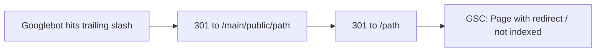

# Why some URLs drop from Google’s index

This is based on **live responses from suavecreators.com** (21 Aug 2026) plus matching code. Production is **not** currently blocking crawlers site-wide.

Implement the fix in `D:\suave-creators` — not inside `D:\design`.

## What is happening (with evidence)

Google does not “unpublish” the canonical page at random. It **indexes extra copies** of the same page (`/about-us/`, `/main/public/about-us`, old `/service/...` paths), then **drops those copies** when they 301 or 404. In Search Console that looks like pages disappearing automatically.



### 1. Primary issue: trailing slash creates `/main/public/` URLs (live, every page)

Hostinger serves the Laravel app from a `main/public` deploy path. The trailing-slash rule in [`public/.htaccess`](../../public/.htaccess) uses `%{REQUEST_URI}`, which on this host **includes that prefix**.

```apache
# Redirect Trailing Slashes If Not A Folder...
RewriteCond %{REQUEST_FILENAME} !-d
RewriteCond %{REQUEST_URI} (.+)/$
RewriteRule ^ %1 [L,R=301]
```

**Live curl (21 Aug 2026):**

- `/about-us/` → 301 `https://suavecreators.com/main/public/about-us`
- `/services/` → 301 `https://suavecreators.com/main/public/services`
- `/blogs/` → 301 `https://suavecreators.com/main/public/blogs`
- `/contact-us/` → 301 `https://suavecreators.com/main/public/contact-us`
- `/services/web-development-services/` → 301 `https://suavecreators.com/main/public/services/web-development-services`
- `/blogs/category/web-development/` → 301 `https://suavecreators.com/main/public/blogs/category/web-development`
- `/main/public/about-us` → 301 `/about-us` (cleanup works)
- `/main/public/about-us/` → 301 `/about-us/` (cleanup **keeps the slash**, which re-enters the leak)

The cleanup rule and Laravel route exist because this leak was already known:

- [`public/.htaccess`](../../public/.htaccess) comment: “Redirect leaked old `/main/public` URLs”
- [`routes/web.php`](../../routes/web.php) `/main/public/{path}` → 301 to the clean path
- [`tests/Feature/SeoSitelinksCleanupTest.php`](../../tests/Feature/SeoSitelinksCleanupTest.php)

Googlebot routinely crawls trailing-slash variants. Each one mints a `/main/public/...` URL, then that URL is 301’d away. Search Console reports those as **Excluded → Page with redirect** (or **Redirect error** on longer chains). That matches “random pages removed automatically”: whichever slash URLs Google crawled that week.

The `/main/public/about-us/` → `/about-us/` → `/main/public/about-us` → `/about-us` chain is 3 hops. Google indexes only the final URL and **removes the intermediates**.

### 2. Draft case studies are 404 for Google

[`CaseStudyController`](../../app/Http/Controllers/Frontend/CaseStudyController.php) `draftView()` does `abort_unless(Auth::check(), 404)`.

**Live:** `/teerrath-case-study` and `/cabvi-case-study` return **404**. The 404 layout sends `<meta name="robots" content="noindex">`.

Catalog status is `draft` in [`CaseStudySupport`](../../app/Support/Frontend/CaseStudySupport.php). Config also sets `'robots' => 'noindex, nofollow'` for those routes in [`config/seo.php`](../../config/seo.php) (never served to Google, because the 404 happens first).

If Google ever indexed those URLs while they were public, they are now **Not found (404)** and will be dropped. They are **not** in the live sitemap (correct).

### 3. Old marketing URLs are 301s (expected de-index of the old URL)

Live:

- `/service/web-development-services` → **301** `/services/web-development-services`
- `/case-studies/turbo-trans-corporation-case-study` → **301** `/turbo-trans-case-study`
- `/industry` → **301** `/industries`
- `https://www.suavecreators.com/` → **301** `https://suavecreators.com/`

Google removes the **source** URL from the index and keeps the destination. That is correct, but it shows up in GSC as pages leaving the index.

Unknown service slugs 404 (`/services/ui-ux-design` live **404**). Only four service slugs exist in `ServiceSupport::SLUGS`.

### 4. Site-wide noindex is not the current cause

Code can noindex everything when `SEO_NOINDEX=true` or `APP_ENV=staging` ([`config/seo.php`](../../config/seo.php), [`SeoGenerateService`](../../app/Services/SeoGenerateService.php), [`SitemapService`](../../app/Services/SitemapService.php)).

**Live evidence this is off right now:**

- `/robots.txt` is `Allow: /` + sitemap (not `Disallow: /`)
- Homepage and `/turbo-trans-case-study` emit `robots: index, follow, ...`
- `/sitemap.xml` is **200** and lists published pages (home, services, industries, blogs, published case studies)

Do not treat staging noindex as the explanation unless GSC snapshots show `noindex` on dates when `SEO_NOINDEX` was true.

## Weaker / not proven as the de-index driver

- **hreflang:** live HTML repeats the **same** canonical URL for `en`, `en-in`, `en-us`, `en-gb`, `x-default` ([`config/seo.php`](../../config/seo.php) + [`SeoGenerateService`](../../app/Services/SeoGenerateService.php)). Invalid hreflang; GSC will flag it. Google’s docs do not say this deletes random URLs from the index.
- **Blog `?page=2`:** canonical is `/blogs` (correct). Page 2 will not be indexed as its own URL.
- **Homepage sitemap vs canonical:** sitemap loc is `https://suavecreators.com` (no slash); page canonical is `https://suavecreators.com/`. Minor duplicate signal, homepage only.
- **“Crawled – currently not indexed”** on the **canonical** URL (same path Google should keep) is a Google quality decision. Code cannot prove that without GSC coverage for those exact URLs.

## Fix

Change [`public/.htaccess`](../../public/.htaccess) so trailing-slash redirects use **`%{THE_REQUEST}`** (the URL the client asked for), not `%{REQUEST_URI}` (Hostinger’s internal `/main/public` path). Collapse `/main/public/.../` to the clean path **without** a trailing slash in **one** hop so the two rules cannot ping-pong.

Add a feature test that documents the intended `Location` (`/about-us`, not `/main/public/about-us`). Live Hostinger behavior cannot be fully reproduced in phpunit; after deploy, re-curl `/about-us/` and `/services/web-development-services/` and expect a single 301 to the clean URL.

Optional follow-up (not required to stop the leak): emit only `en` + `x-default` hreflang, or drop hreflang until there are real locale URLs.

## How to confirm in Search Console

Filter coverage for:

- `https://suavecreators.com/main/public/`
- URLs ending in `/` that are not the homepage
- Old `/service/` paths
- `/teerrath-case-study` and `/cabvi-case-study`

Expected reasons today: **Page with redirect**, **Not found (404)**, **Redirect error**. Those match the live HTTP above.
