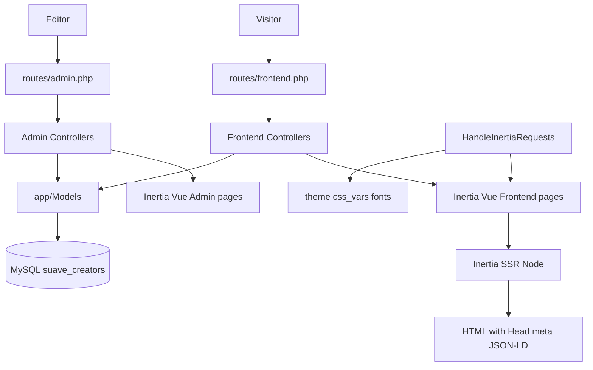
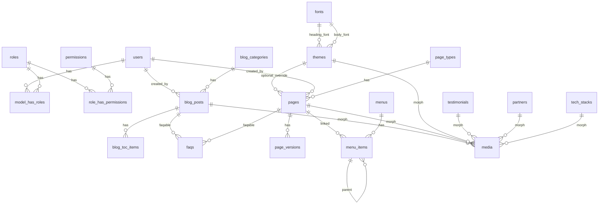
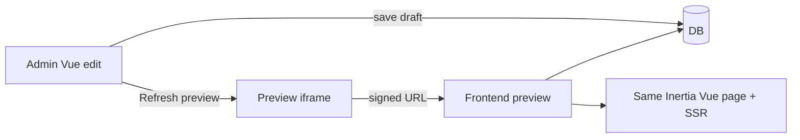
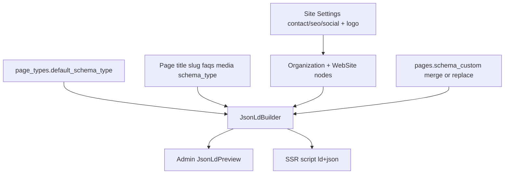

# Full Laravel migration plan (one project, two directories)

## Project locations (locked)

| Role | Path |
|------|------|
| **Plan docs** (this file) | `D:\design\plans\` |
| **Legacy PHP site** (read-only reference / content source) | `D:\design` |
| **CMS reference** (Inertia patterns, import pipeline) | `D:\cms` |
| **New Laravel app** (implement here — fresh folder, **not** inside `D:\design`) | `D:\suave-creators` |

**Rules:**
- Scaffold and develop only in `D:\suave-creators` (create if missing).
- Do **not** convert `D:\design` in place; keep it as `_legacy` source until cutover.
- Keep this plan updated under `D:\design\plans\` as the project plan of record.
- Cursor may also keep a copy under `%USERPROFILE%\.cursor\plans\` — prefer syncing important edits back to `D:\design\plans\`.

## Stack (locked)

| Layer | Choice |
|-------|--------|
| Project root | **`D:\suave-creators`** — one Laravel 11+ app |
| Separation | `app/Frontend` + `app/Admin` (both Inertia Vue) |
| Public UI | **Vue 3 + Inertia + Vite + Tailwind CSS + SSR** |
| Admin UI | **Vue 3 + Inertia** at `/admin` — **no Filament**, **no Breeze/Jetstream** |
| Admin look | **Metronic-inspired** modern dashboard (hand-rolled Tailwind Ui — not a Metronic license install) |
| **CSS** | **Tailwind CSS v4** via `@tailwindcss/vite` — **locked**; no Play CDN, no Bootstrap, no separate SCSS framework |
| Vue UI | Hand-rolled `Components/Ui` (Tailwind utilities + `cn()`) + Admin/Frontend (see component plan) |
| Reference | [D:\cms](D:\cms): admin routes, Media/Themes/Pages/Settings controllers, `admin` guard, shared theme props — cms uses **React**; this project uses **Vue** |
| DB | MySQL 8 `suave_creators` |
| Auth / roles | `auth:admin` guard + `spatie/laravel-permission` |
| Media | Spatie Media Library + custom Vue Media admin (like cms `MediaController`) |
| Themes / fonts | `themes.typography` scale + `css_vars` + Font Library → bridged into Tailwind `@theme` |
| SEO | Inertia `<Head>` + SSR |
| Cache | Redis (prod) + tagged/keyed app cache; write-through invalidation |
| Page import | `database/imports` + `cms:import-pages` / `cms:scrape-page` (cms parity) |

No Filament. Admin and frontend are both Vue/Inertia (cms pattern). **Styling = Tailwind** for all Vue SFCs (admin + public); theme/custom CSS only for runtime tokens and editor overrides.
---

## Gap check — missing vs current site / a complete CMS

Compared to the live PHP site and a production-ready Inertia CMS (D:\cms), the plan above is strong on stack/schema but **thin or silent** on the items below.

### Must add (in scope — missing from plan detail)

| Gap | Why it matters |
|-----|----------------|
| **Legal pages** | Footer links `/privacy-policy` and `/terms-and-conditions` exist but pages are **404** today — need routes + admin-editable pages |
| **Branded 404** | Router today returns plain text; need Inertia Vue 404 page (SSR) |
| **URL redirects** | Keep SEO: `.php` and trailing-slash variants → clean URLs |
| **Contact field completeness** | Site has `country_code`, optional phone, hidden `service`; plan only lists generic lead fields — align schema + Form Request |
| **Contact email notify** | Plan mentions mail vaguely; need explicit notification to site inbox + thank-you/error UI |
| **Announcement topbar** | `partials/topbar.php` (dismissible Suave CRM bar) — manage via Site Settings |
| **Header / footer / nav CMS** | Covered: **Menu builder** (`menus` / `menu_items`) + contact/social settings groups |
| **Product page CMS** | `/product` is a large custom page (modules, pricing, tabs) — plan lists `pages.product` JSON only; needs explicit Product sections or dedicated resource |
| **Home / About / hubs as editable pages** | `pages` table exists but section-level editing for home, about, services hub, industry hub is underspecified |
| **Tech stack logos** | `data/tech-stack.php` — no model/resource in plan |
| **Partners / client logos** | Hardcoded marquees — no Partner/Logo resource |
| **Centralize testimonials** | Plan has model; must replace duplicated partials as single source |
| **UI parity checklist** | Swiper instances, marquees, mobile nav, FAQ accordion, product/industry/agile **tabs**, about counters, floating chat CTA — not listed as deliverables |
| **Vite + Tailwind + Vue SSR** | Drop `cdn.tailwindcss.com` Play CDN; install **Tailwind v4** via Vite; port `_legacy/css/style.css` leftovers into utilities/`@layer`; run `build:ssr` in prod |
| **Favicon + default OG image** | Missing on current site and not in plan |
| **Lead notify + spam** | Rate limit/honeypot noted; add mail + success flash explicitly |
| **Phone/address single source** | Site has inconsistent numbers — Site Settings must own them |
| **Blog share base URL** | Hardcoded `suavecreators.com` today → use `APP_URL` |
| **Eager-load / N+1** | Mentioned lightly; seed + frontend should use `with('media','faqs')` |
| **Policies per admin controller** | Roles listed; wire Policies / middleware in phase 1 |
| **Queue for mail (optional but recommended)** | Contact notify should not block request |

### Should decide (content IA — not in plan)

| Item | Recommendation (locked default) |
|------|----------------------------------|
| Real Estate industry link `#` | Remove dead link or add industry page — **default: remove/hide until content exists** |
| Portfolio images | **CMS gallery on Service/Industry** (already partly via media `gallery`); no separate Portfolio post type in v1 |
| Digital Marketing as own `/service/...` | **Out of v1** — keep as home section only |
| Product “Start trial” | **Stay contact CTA** (no billing/signup in v1) |
| Footer product deep links | **Add anchors** on product page modules in frontend port |

### Explicitly out of scope for v1 (absent on current site too)

- Public auth / member area
- Multi-language
- Newsletter
- Site search
- Cookie consent / GA (add later if marketing asks)
- Real SaaS billing for Suave CRM
- Dedicated careers/case-study *modules* in v1 (can add via **dynamic page types** + page editor without new code)

### Admin screens still missing from the resource table

Add Vue/Inertia admin pages (cms-style) for:

- **Legal / static pages** via `pages` + `legal` type
- **Tech stacks** / **Partners / logos**
- **Page types** + **Menu builder** (in schema/admin table — implement in phase 1–2)
- **Announcement bar** fields on Site Settings
- **Product page** via page editor + `product` type

### Frontend deliverables still missing from phases

- Port all Swiper + marquee + tab + FAQ + counter behaviors
- Contact success/error UX
- Legal routes
- Custom 404
- Redirects for legacy `.php` URLs
- Homepage meta (currently empty on legacy home)

---

## Plan review — covered vs still missing

Reviewed against live site, `D:\design`, and `D:\cms`. Items below are the honest remaining gaps after recent plan iterations.

### Now covered in plan (was thin before)

| Area | Plan location |
|------|----------------|
| Dynamic page types + menu builder | Schema + admin |
| SEO meta + OG/Twitter + validation | SEO meta section |
| Redis/app caching + clear cache | Caching architecture |
| Vue component inventory (no starter kit) | Vue components plan |
| Theme typography scale (size/weight) | Themes § Typography |
| Page import + AI scrape CLI | **Page import pipeline** (v1) |
| CodeMirror page editor + versions/partials | Page editor cms-parity |

### Still must implement (in scope — ensure not dropped)

| Gap | Add to delivery |
|-----|-----------------|
| **`redirects` table** | `from_path` → `to_path`, status 301/302; seed `.php` + trailing-slash → clean URLs; middleware or route fallback |
| **Admin password change** | Profile page: change own password; optional forgot-password for `admin` guard (email via SMTP) — no public register |
| **Blog seed from `_legacy`** | Import existing blog PHP/data into `blog_posts` + media (not only pages via imports) |
| **Legal pages content** | Import HTML for privacy/terms (today 404) |
| **Favicon + default OG** | Theme/settings media; SeoMetaBuilder fallback |
| **Announcement bar admin** | CRUD or settings fields wired to `SiteTopbar.vue` |
| **Contact schema parity** | `country_code`, optional phone, hidden `service`; notify mail queued; honeypot + throttle |
| **UI parity checklist** | Explicit QA: Swiper, marquees, mobile nav, tabs, counters, floating CTA |
| **Tailwind via Vite** | No Play CDN; `@tailwindcss/vite`; theme `@theme` bridge; port `_legacy` CSS leftovers |
| **SSR deploy** | Document Node SSR process (supervisor/systemd), `build:ssr`, health check |
| **Feature tests** | Full matrix in **Testing strategy** below |
| **Cursor skills** | Incl. **`suave-php-conventions`** (Controller/Model/Service/Request) + domain skills |
| **Helpers** | `getSetting`, `createFlashMessage($type, $action)` → “X has been Y successfully.” |
| **Form Ui contract** | label/required/error; clear error on change; Switch; FileDropzone |
| **Spatie conversions** | `thumb` + webp for cards/OG |
| **`.env.example`** | Redis, SMTP, OpenAI (scrape), `CACHE_*`, admin URL notes |

### Schema to add — `redirects`

| Column | Type | Notes |
|--------|------|-------|
| id | bigint PK | |
| from_path | varchar(255) unique | e.g. `/about-us.php`, `/about-us/` |
| to_path | varchar(255) | e.g. `/about-us` |
| status_code | smallint default 301 | |
| is_active | boolean | |
| timestamps | | |

Middleware: match `from_path` before 404; admin CRUD optional v1 (seed + import enough if time-boxed).

### Intentionally Phase 2 (do not block launch)

- Content Sections module / DB snapshots
- Public search, i18n, newsletter, cookie consent, GA (unless marketing requires)
- Full-page CDN HTML cache with purge
- Careers dedicated module (use page_types instead)

### Stale gap-check rows (treat as resolved when implementing)

Earlier “Must add” table still lists Product/Home as “JSON only” and menus as missing — **superseded** by page editor + menu builder + import pipeline. Prefer this review section as source of truth for remaining work.

## High-level architecture



**Deploy:** `public/` + **SSR Node** for public SEO. Site `/`, admin `/admin` (Inertia Vue; SSR optional for admin).

### Frontend stack detail (Vue + Inertia + SSR)

Mirror [D:\cms](D:\cms) (`build:ssr`, `config/inertia.php` ssr, shared theme props) with Vue packages:

| Piece | Package / path |
|-------|----------------|
| Inertia Laravel | `inertiajs/inertia-laravel` |
| Vue adapter | `@inertiajs/vue3` + `vue` |
| Vite | `laravel-vite-plugin`, `@vitejs/plugin-vue` |
| **CSS** | **`tailwindcss` + `@tailwindcss/vite`** (Tailwind v4) — import in `resources/css/app.css` / `admin.css` |
| Class helpers | `clsx` + `tailwind-merge` → `resources/js/lib/cn.ts` |
| SSR entry | `resources/js/ssr.ts` → `bootstrap/ssr/ssr.mjs` |
| Client entry | `resources/js/app.ts` → `createInertiaApp` + `@vite` CSS entry |
| Shared props | `HandleInertiaRequests` — `theme` (`css_vars_string`, `font_urls`, `global_css`, site branding), `auth` null on public |
| Pages | `resources/js/Pages/Frontend/*` (Home, About, Product, ServiceShow, IndustryShow, BlogShow, Contact, …) |
| Layouts | `resources/js/Layouts/FrontendLayout.vue` — header/footer, inject `:root` + font links like cms `FrontendPageLayout` |
| SEO | `@inertiajs/vue3` `<Head>`: title, meta, canonical, OG; JSON-LD via `<component :is="'script'" type="application/ld+json">` or Head child — **must render under SSR** |

**Controllers:** `return Inertia::render('Frontend/ServiceShow', [...])` (same idea as cms `Inertia::render('Frontend/DynamicPage', …)`).

**Why SSR is required:** crawlers and social previews need title/description/JSON-LD in the first HTML response (same reason cms runs `vite build --ssr`).

### Tailwind CSS (locked)

Legacy site loads **Tailwind Play CDN** (`cdn.tailwindcss.com`) plus `/css/style.css`. New app must **not** use the Play CDN in any environment.

| Rule | Detail |
|------|--------|
| **Version** | **Tailwind CSS v4** with official Vite plugin `@tailwindcss/vite` |
| **Entry** | `resources/css/app.css` (public + shared) and `resources/css/admin.css` (admin-only tokens/layout) |
| **Wire-up** | `vite.config.ts` registers `tailwindcss()`; Blade root `@vite(['resources/css/app.css', 'resources/js/app.ts'])`; admin layout also pulls `admin.css` (or a single entry that `@import`s both when route is admin) |
| **Source scan** | Tailwind content = all Vue/TS under `resources/js/**/*.{vue,js,ts}` (v4 auto-detects from Vite graph; no separate `tailwind.config.js` content array required unless customizing) |
| **Utilities first** | Layout, spacing, typography roles, colors, responsive, hover/focus — all via Tailwind classes on Vue SFCs |
| **`cn()`** | Every Ui/Admin/Frontend component merges classes with `cn()` (`clsx` + `tailwind-merge`) |
| **Theme bridge (required)** | Map theme `css_vars` into `@theme` / `@layer` so utilities like `text-h1`, `bg-primary`, `text-header`, `rounded-button` resolve to `var(--…)` — never hardcode brand `text-4xl` / hex in marketing components |
| **Admin tokens** | Expose `--admin-*` as Tailwind theme keys (e.g. `bg-admin-sidebar`, `text-admin-muted`) in `admin.css` |
| **Legacy CSS port** | Re-express `_legacy/css/style.css` + `product.css` as Tailwind utilities or small `@layer components` only when a utility cannot express the rule (marquees, Swiper tweaks, gradient text) |
| **Allowed non-Tailwind CSS** | (1) injected `:root` from theme, (2) theme `global_css`, (3) settings `custom_css`, (4) page_version `css` tab, (5) third-party (Swiper) — not a parallel design system |
| **Forbidden** | `cdn.tailwindcss.com`, Bootstrap, DaisyUI/full kits, large hand-written BEM sheets for new UI |

**`resources/css/app.css` sketch:**

```css
@import "tailwindcss";

/* Runtime :root (Inertia theme.css_vars_string) sets --color-primary, --text-h1, --font-body, etc. */

@theme {
  --font-sans: var(--font-body), ui-sans-serif, system-ui, sans-serif;
  --color-primary: var(--color-primary);
  --color-accent: var(--color-accent);
  --color-bg: var(--color-bg);
  --color-text: var(--color-text);
  --text-display: var(--text-display);
  --text-h1: var(--text-h1);
  /* …remaining typography + header/footer tokens → utilities (bg-primary, text-h1, …) */
}

@layer base {
  h1, .text-h1 {
    font-family: var(--font-heading);
    font-size: var(--text-h1);
    font-weight: var(--font-weight-h1);
    line-height: var(--leading-h1);
    letter-spacing: var(--tracking-h1);
  }
  body {
    font-family: var(--font-body);
    font-size: var(--text-body);
    font-weight: var(--font-weight-body);
    line-height: var(--leading-body);
  }
}

@layer components {
  /* Only leftovers that utilities cannot express cleanly (e.g. marquee keyframes) */
}
```

Note: if `@theme` self-reference is awkward for a token, alias runtime vars (e.g. theme emits `--sc-color-primary`, `@theme` sets `--color-primary: var(--sc-color-primary)`). Pick one aliasing scheme in foundation and stick to it.

**Port checklist (foundation + public Vue phase):**
1. Scaffold Tailwind v4 + Vite plugin; confirm utilities purge/build in `npm run build` and SSR build
2. Seed Suave colors/type into theme `css_vars` and mirror into `@theme`
3. Build `Components/Ui/*` with Tailwind only
4. Port header/footer/partials using the same utility vocabulary as `_legacy` where class names already match Tailwind
5. Delete any leftover Play CDN script from Blade; no runtime `tailwind.config = {…}` in `<script>`

---

## Repository / file structure

Single project; frontend and admin kept in **separate directories**:

```text
/
├── app/
│   ├── Support/helpers.php           # getSetting, createFlashMessage (autoload)
│   ├── Models/
│   ├── Frontend/
│   │   ├── Http/Controllers/         # Inertia::render(...) public controllers
│   │   ├── Http/Middleware/HandleInertiaRequests.php  # like D:\cms — theme, fonts
│   │   ├── Http/Requests/
│   │   └── Services/SeoMetaBuilder.php, JsonLdBuilder.php
│   ├── Admin/
│   │   ├── Http/Controllers/         # like D:\cms admin: Pages, Blogs, Media, Themes, Settings, Users, Roles, Leads
│   │   └── Http/Middleware/          # admin.session, auth:admin
│   └── Providers/
├── bootstrap/
│   ├── app.php
│   └── ssr/ssr.mjs
├── config/inertia.php
├── config/auth.php                   # admin guard (cms-style)
├── database/...
├── resources/
│   ├── js/
│   │   ├── app.ts                    # createInertiaApp — resolve Pages/*
│   │   ├── ssr.ts
│   │   ├── Pages/Frontend/           # Inertia pages (public)
│   │   ├── Pages/Admin/              # Inertia pages (admin)
│   │   ├── Pages/Admin/Auth/Login.vue
│   │   ├── Layouts/
│   │   │   ├── FrontendLayout.vue
│   │   │   ├── AdminLayout.vue
│   │   │   └── templates/            # default, container, landing, minimal
│   │   ├── Components/
│   │   │   ├── Ui/                   # minimal design system (no starter kit)
│   │   │   ├── Admin/                # CMS building blocks
│   │   │   └── Frontend/             # site chrome + marketing sections
│   │   ├── partials/                 # CMS code partials (Hero, Faq, …)
│   │   ├── Composables/              # useFlash, useConfirm, useSeoCounters, …
│   │   ├── lib/                      # cn(), api helpers, constants
│   │   └── types/                    # shared TS interfaces
│   ├── css/
│   │   ├── app.css                   # Tailwind v4 entry + @theme → theme css_vars
│   │   └── admin.css                 # Admin tokens / Metronic chrome (imported on admin)
│   └── views/app.blade.php           # Inertia root only — @vite CSS+JS, no Play CDN
├── routes/frontend.php
├── routes/admin.php                  # prefix /admin, auth:admin (mirror D:\cms\routes\admin.php)
├── package.json                      # build, build:ssr; deps: tailwindcss, @tailwindcss/vite, clsx, tailwind-merge
├── vite.config.ts                    # vue + laravel + tailwindcss()
├── _legacy/
└── .env
```

Namespaces: `App\Frontend\...`, `App\Admin\...`, `App\Models\...`.

**Note:** [D:\cms](D:\cms) uses React Inertia admin. This project uses **Vue** Inertia for **both** public + admin — **no Filament**, **no Breeze/Jetstream/starter kit**. Build layouts + UI primitives ourselves with **Tailwind** (see Vue components plan below).

Public routes in `routes/frontend.php` (from [`router.php`](router.php)):

- `/`, `/about-us`, `/product`, `/contact-us`, `/blogs`, `/services`, `/industry`
- `/service/{slug}`, `/industries/{slug}`, `/blog/{slug}`
- `POST /contact`
- `/preview/{type}/{id}` — signed draft preview (admin only; noindex)
- `/sitemap.xml`, `/robots.txt`, `/llms.txt`, `/llms-full.txt`

---

## Vue components plan (no starter kit)

Scaffold with plain Laravel + Inertia Vue + Vite + **Tailwind CSS v4** only. Do **not** install Breeze, Jetstream, or shadcn-vue full kits. Hand-roll a small UI layer inspired by cms patterns, in Vue SFCs styled with Tailwind utilities + `cn()`.

### Admin visual theme — Metronic-inspired (locked)

Admin (`/admin`) must look like a **modern Metronic-style** dashboard — clean, dense-but-breathable SaaS admin — **not** a flat unstyled CRUD shell and **not** copying the public Suave marketing look into admin.

**Approach (locked):** hand-build with **Tailwind** + our `Components/Ui` to **match Metronic’s UX patterns**. Do **not** vendor Metronic source / KeenThemes license into the repo unless the team separately purchases and explicitly asks to integrate it. Inspiration only (layout + density + chrome).

**Layout chrome:**
- Fixed **left sidebar** (collapsible to icons; mobile → `Drawer`)
- Sticky **topbar**: page title / breadcrumbs, global search (optional v1), user menu, notifications slot
- Soft **content canvas** (light gray page bg `#F9F9F9` / `#F5F8FA`-class; white content panels)
- Optional compact **toolbar** under topbar on index pages (filters + primary CTA)

**Visual language:**
- Sidebar: dark (Metronic demo-style) **or** light with clear active state — pick **one** default: **dark sidebar + light content** (classic Metronic)
- Active nav: accent pill / left bar + icon + label
- Grouped nav sections (Content, Design, SEO, System) with section labels
- Cards/panels: light border, subtle shadow, ~8–12px radius (not heavy glassmorphism)
- Tables: compact rows, sticky header optional, row hover, action icons right-aligned
- Forms: labeled fields, consistent vertical rhythm, primary/secondary button hierarchy
- Stats on Dashboard: small KPI tiles (count + label), Metronic “engage” density without clutter
- Typography: clean sans (e.g. Inter **only inside admin** is OK — public site still uses Theme Font Library)
- Icons: `lucide-vue-next` consistently sized

**CSS tokens for admin** (separate from public theme `css_vars`) — define in `resources/css/admin.css` and expose as Tailwind `@theme` keys:

```css
@import "tailwindcss";

@theme {
  --color-admin-sidebar: #1e1e2d;
  --color-admin-sidebar-text: #9899ac;
  --color-admin-sidebar-active: #ffffff;
  --color-admin-accent: #009ef7; /* Metronic-like primary; can tint to Suave blue */
  --color-admin-content: #f5f8fa;
  --color-admin-card: #ffffff;
  --color-admin-border: #eff2f5;
  --color-admin-text: #181c32;
  --color-admin-muted: #a1a5b7;
}
```

Wire `admin.css` only on admin Inertia pages (or scoped layout class `admin-app`). Prefer utilities: `bg-admin-sidebar`, `text-admin-muted`, `bg-admin-content`, etc. — not raw hex in SFCs.

**Pages that must feel Metronic-grade:** Login, Dashboard, all Index tables, Settings, Themes, Media grid, Page editor chrome (toolbars), SEO tabs.

**Skill `suave-admin-vue`:** document Metronic-inspired layout rules + token list + do-not use marketing hero layouts in admin.

### Principles

- Thin **Ui/** primitives reused by Admin + (sparingly) Frontend
- **Admin/** CMS widgets (MediaPicker, editors, tables) — not page-specific
- **Frontend/** chrome + marketing sections ported from `_legacy/partials`
- **Pages/** are thin: compose layout + components + Inertia props
- **partials/** = injectable CMS blocks for the page editor (`data-partial`)
- Prefer composition API + `<script setup lang="ts">`
- Icons: `lucide-vue-next` (or FA if matching live site icons) — one choice, stick to it in admin

### Directory map

```
resources/js/
  Components/Ui/           # design system
  Components/Admin/        # CMS shared
  Components/Frontend/     # public site
  Layouts/
  Pages/Admin/
  Pages/Frontend/
  partials/                # editor-injectable blocks
  Composables/
  lib/
  types/
```

---

### A. `Components/Ui/` — minimal design system

Build only what admin + forms need (no kitchen-sink component library).

**Overlay primitives (required — build first):**

| Component | Role | API (locked) |
|-----------|------|----------------|
| `Modal.vue` | Centered dialog overlay | Props: `open`, `title`, `description?`, `size` (`sm`/`md`/`lg`/`xl`/`full`), `closable`; emits `update:open`; slots: default, `footer`, `header`; focus trap + Esc + backdrop click; body scroll lock |
| `Drawer.vue` | Side panel (sheet) | Props: `open`, `side` (`left`/`right`/`bottom`), `title`, `width`/`size`; emits `update:open`; slots: default, `footer`; used for PartialPicker, version history, mobile nav, filters |
| `Confirm.vue` | Destructive / confirm action | Props: `open`, `title`, `message`, `confirmLabel`, `cancelLabel`, `variant` (`danger`/`default`); emits `confirm` / `cancel` / `update:open`; optional `ConfirmProvider` + `useConfirm()` promise API (`await confirm({ title, message })`) |

Do **not** conflate these: `Modal` = content forms/pickers; `Drawer` = secondary panels; `Confirm` = yes/no only. Higher-level admin widgets (`SeoModal`, `MediaPicker`, `ClearCachePanel`) **compose** these primitives.

**Form field primitives (required — shared contract):**

Every form control that collects input **must** support:

| Prop | Type | Role |
|------|------|------|
| `label` | string | Visible label text |
| `required` | boolean | Shows required indicator; pairs with HTML `required` / aria when appropriate |
| `error` | string \| string[] \| null | Validation message under the field |
| `modelValue` / `v-model` | — | Field value |
| `id` / `name` | string | Accessibility + form wiring |
| `disabled` / `hint` | optional | |

**Clear error on change (locked):** when the user updates the value (`update:modelValue`), the component emits `clear-error` **or** the parent clears `errors.field` (Inertia `form.clearErrors('field')` / `useForm` clear). Prefer a thin wrapper `useClearableField(form, 'email')` so typing always clears that field’s error. Never leave a stale error visible after the value changes.

| Component | Role |
|-----------|------|
| `Input.vue` | text/email/url/number — `label`, `required`, `error`, clear-on-input |
| `Textarea.vue` | same contract |
| `Select.vue` | same contract |
| `Checkbox.vue` | same contract |
| `Switch.vue` | **required** toggle — `label`, `required`, `error`, `v-model` boolean; clear error on toggle |
| `FileDropzone.vue` | **required** drag-and-drop upload — `label`, `required`, `error`, `accept`, `multiple`, `maxSize`; emits `files`; clear error on new selection; used by MediaUploader / font upload |
| `Label.vue` | shared label + required asterisk |
| `InputError.vue` | renders `error` prop |
| `CharCounter.vue` | SEO soft/hard limit (works beside Input/Textarea) |
| `SlugInput.vue` | wraps Input + auto-slug (Admin can re-export) |

**Other Ui primitives:**

| Component | Role |
|-----------|------|
| `Button.vue` | primary / secondary / ghost / danger / sizes |
| `DropdownMenu.vue` | user menu, row actions |
| `Tabs.vue` | settings groups, page editor HTML/CSS/JS |
| `Badge.vue`, `Alert.vue`, `Spinner.vue`, `Skeleton.vue` | status |
| `Table.vue` + `Pagination.vue` | index lists |
| `Card.vue` | admin panels only (interaction containers) |
| `Tooltip.vue` | optional |
| `FlashToast.vue` | session flash from layout (`createFlashMessage` payload) |
| `EmptyState.vue` | empty index pages |
| `Breadcrumbs.vue` | admin header |

`lib/cn.ts` — `clsx` + `tailwind-merge`. Tokens via CSS variables + Tailwind `@theme` (public theme / admin tokens), not hardcoded purple kits.

**Usage map:**
- `Modal` → SEO settings, MediaPicker, create page-type, role edit (small forms)
- `Drawer` → PartialPicker, partial props, version history, mobile `AdminSidebar`, optional filters
- `Confirm` → delete page/user/media, clear cache, discard unsaved, restore version
- `Switch` → is_active, robots_index, dismissible, published toggles
- `FileDropzone` → media library upload, font file upload

---

### B. `Layouts/`

| File | Role |
|------|------|
| `AdminLayout.vue` | **Metronic-style** fixed dark sidebar + sticky topbar + content canvas + flash |
| `AdminAuthLayout.vue` | Modern centered login card (Metronic auth feel) |
| `FrontendLayout.vue` | Topbar + Header + Footer; inject theme `:root` + font links; `<Head>` slot support |
| `templates/Default.vue` | page template wrappers (cms parity) |
| `templates/Container.vue` | |
| `templates/Landing.vue` | |
| `templates/Minimal.vue` | |

**Admin shell pieces** (can live under `Components/Admin/`):

| Component | Role |
|-----------|------|
| `AdminSidebar.vue` | nav groups: Content, Design, Settings, System |
| `AdminNavItem.vue` | link + active state + permission gate |
| `AdminTopbar.vue` | page title, user menu, logout |
| `AdminUserMenu.vue` | profile / logout |

---

### C. `Components/Admin/` — CMS building blocks

| Component | Role |
|-----------|------|
| `MediaPicker.vue` | modal grid; single/multi; returns media id/url (cms MediaPicker) |
| `MediaUploader.vue` | drag-drop upload into library |
| `DataTable.vue` | sortable columns, row actions, bulk optional |
| `SearchFilterBar.vue` | search + status/type filters |
| `StatusBadge.vue` | draft/published |
| `CodeMirrorField.vue` | HTML/CSS/JS modes wrapper |
| `TipTapEditor.vue` | blog body |
| `SeoModal.vue` | wraps `Modal`; full SEO + **JSON-LD** tab + counters + SERP/OG/Twitter preview |
| `JsonLdPreview.vue` | pretty-print / validate built or custom schema JSON |
| `SchemaTypeSelect.vue` | WebPage, AboutPage, ContactPage, FAQPage, Service, … |
| `SeoSerpPreview.vue` | Google-style snippet |
| `SeoSocialPreview.vue` | OG / Twitter card mock |
| `PartialPicker.vue` | insert `data-partial` blocks |
| `PartialFieldControl.vue` | edit partial props in preview |
| `PageEditor.vue` | split panes: CodeMirror tabs + preview iframe |
| `PreviewFrame.vue` | iframe + viewport toggles (desktop/tablet/mobile) |
| `VersionHistory.vue` | list/restore page versions |
| `MenuTreeBuilder.vue` | DnD nested menu items |
| `MenuItemForm.vue` | page picker vs custom URL |
| `PageTypeForm.vue` | create/edit page type fields |
| `PermissionMatrix.vue` | role permissions checkboxes |
| `SettingsGroupForm.vue` | dynamic fields per settings group |
| `SmtpTestButton.vue` | send test email |
| `ClearCachePanel.vue` | scoped cache clear actions |
| `ThemeCssField.vue` | CodeMirror + live token hints |
| `FontPicker.vue` | assign heading/body/mono from Font Library |
| `TypographyScaleEditor.vue` | edit sizes, weights, line-heights, letter-spacing + live Aa preview |
| `TypographyPreview.vue` | sample stack Display → Caption |
| `HeaderFooterSettings.vue` | sticky Switch, width mode, height, max-width, header/footer colors |
| `FaqRepeater.vue` | polymorphic FAQ rows |
| `TocRepeater.vue` | blog TOC items |
| `SlugInput.vue` | auto-slug from title + lock |
| `PublishBar.vue` | Save draft / Publish / Preview |

---

### D. `Pages/Admin/` — Inertia screens

| Page | Notes |
|------|-------|
| `Auth/Login.vue` | admin guard login only |
| `Dashboard.vue` | counts: leads, drafts, published |
| `Pages/Index.vue`, `Pages/Edit.vue` | filter by type; PageEditor |
| `PageTypes/Index.vue`, `PageTypes/Edit.vue` | dynamic types |
| `Partials/Index.vue`, `Partials/Edit.vue` | static/code partials |
| `Blogs/Index.vue`, `Blogs/Edit.vue` | TipTap + SEO + FAQs + TOC |
| `Menus/Index.vue`, `Menus/Edit.vue` | MenuTreeBuilder |
| `Media/Index.vue` | library grid |
| `Testimonials/Index.vue` (+ Edit if needed) | CRUD |
| `TechStacks/Index.vue` | CRUD |
| `Partners/Index.vue` | CRUD |
| `ContactRequests/Index.vue`, `Show.vue` | leads inbox |
| `Fonts/Index.vue` | Font Library |
| `Themes/Index.vue`, `Themes/Edit.vue` | Colors, Typography, **Header & Footer** (sticky/width), Fonts, Global CSS |
| `Settings/Index.vue` | tabs/sidebar by group |
| `Seo/Index.vue` | sitemap / robots / llms generate & regenerate |
| `Roles/Index.vue`, `Roles/Edit.vue` | PermissionMatrix |
| `Users/Index.vue`, `Users/Edit.vue` | assign roles |
| `Profile/Index.vue` | optional: name/password for self |

No Breeze profile/2FA/settings pages unless later required.

---

### E. `Components/Frontend/` — site chrome + sections

Port from legacy `partials/*` and page sections; keep Suave visual language (not generic AI layout).

**Chrome**
| Component | Source |
|-----------|--------|
| `SiteTopbar.vue` | `partials/topbar.php` |
| `SiteHeader.vue` | `partials/header.php` + menu props |
| `SiteFooter.vue` | `partials/footer.php` + menus |
| `MobileNav.vue` | mobile drawer/menu |
| `FloatingChatCta.vue` | if present on live site |

**Shared marketing**
| Component | Source / use |
|-----------|----------------|
| `TestimonialsSection.vue` | `partials/testimonials-section.php` |
| `TechPartnershipsMarquee.vue` | `partials/tech-partnerships-marquee.php` |
| `ArticlesInsights.vue` | `partials/articles-insights.php` |
| `CoreValuesSection.vue` | `partials/core-values-*.php` |
| `FaqAccordion.vue` | service/industry/blog FAQs |
| `FaqCtaButton.vue` | `partials/faq-cta-button.php` |
| `SwiperCarousel.vue` | thin wrapper around Swiper |
| `LogoMarquee.vue` | partners / clients |
| `ContactForm.vue` | contact page + validation errors |
| `JsonLdScript.vue` | emits ld+json under SSR |
| `SeoHead.vue` | maps SeoMetaBuilder props → Inertia `<Head>` |

**Page-specific sections** (keep under `Components/Frontend/` or colocated with page):
| Component | Page |
|-----------|------|
| `HomeHero.vue`, `Home*` sections | Home |
| `About*` sections (counters, story) | About |
| `ProductModules.vue`, `ProductPricing.vue`, `ProductTabs.vue` | Product |
| `ServiceDetail.vue` | was `partials/service-detail.php` |
| `IndustryDetail.vue` | was `partials/industry-detail.php` |
| `BlogCard.vue`, `BlogShowBody.vue` | blogs |
| `NotFound.vue` content | branded 404 |

---

### F. `Pages/Frontend/` — Inertia pages

**Hybrid (locked):** manage marketing **content** from the backend; keep a few **app-like** Vue pages that are not pure HTML shells.

| Kind | When | Frontend |
|------|------|----------|
| **CMS / DynamicPage** | Home, About, Product, hubs, service/industry detail, legal, any new typed page | `DynamicPage.vue` — HTML/CSS/JS from `page_versions` + partials; editable in admin + importable |
| **App Vue page** | Blogs index/show (TipTap body), Contact (form + validation UX), 404 | Dedicated Vue SFCs; content still from DB where it makes sense (posts, settings) — not a full CodeMirror HTML document |
| **Chrome** | Header/footer/topbar | Always theme layout — never inside imported page HTML |

Do **not** maintain two full copies of Home/About (one hardcoded Vue + one CMS). Marketing pages → backend. Static-feeling pages (privacy, terms) are still CMS rows (`legal` type), not repo-only Blade/Vue files.

| Page | Route |
|------|-------|
| `DynamicPage.vue` (or thin wrappers that only pass props) | `/`, `/about-us`, `/product`, `/services`, `/industry`, `/service/{slug}`, `/industries/{slug}`, legal slugs |
| `BlogIndex.vue` | `/blogs` |
| `BlogShow.vue` | `/blog/{slug}` |
| `Contact.vue` | `/contact-us` |
| `NotFound.vue` | 404 |
| `Preview.vue` | optional signed preview wrapper |

`DynamicPage.vue` (cms-style): render active `page_versions` HTML, hydrate `data-partial` → Vue partials.

---

### G. `partials/` — CMS injectable blocks (Vue)

Inventory locked in **CMS partials inventory** (page review). Each folder: `XxxPartial.vue` + field meta JSON.

**v1 port from cms:** Hero, Section, Cards, Stats, Faq, CtaBand, Testimonials, ContentMedia, ArticleCards, MarqueeLogo, MarqueeText, Static.

**v1 create (P0):** SmartTogetherCta, CoreValues, OfferingsCarousel, PortfolioShowcase.

**v1 create (P1):** Capabilities, ProcessSteps, ImageMarquee (or extend MarqueeLogo).

**P2 / optional:** ExpertiseTabs, AgileProcess, ProductModules, PricingPlans.

---

### H. `Composables/` + `lib/`

| Name | Role |
|------|------|
| `useHeaderSticky.ts` | read `--header-sticky`; set `data-header-sticky` / `data-header-stuck` on `<html>` |
| `useClearableField.ts` | clear Inertia form error when `v-model` updates |
| `useConfirm.ts` | promise-based Confirm |
| `useFlash.ts` | read flash from `createFlashMessage` / session |
| `useSeoCounters.ts` | soft/hard char limits for SEO fields |
| `usePermissions.ts` | `can('pages.update')` from shared auth props |
| `useDebouncedPreview.ts` | page editor preview-cache (~900ms) |
| `useTwoWayProxy` / form helpers | Inertia `useForm` wrappers if needed |
| `lib/cn.ts`, `lib/seo.ts`, `lib/menu.ts` | utilities |

---

### I. Explicitly do **not** create (starter-kit noise)

- Breeze/Jetstream auth (register, forgot password, 2FA, email verify) for public
- Full shadcn-vue / Radix port of every primitive
- Appearance / dark-mode toggle (unless product asks later)
- Generic “app sidebar” marketing dashboard chrome on the public site
- Duplicate Filament-style resource generators

### Build order for Vue layer

1. `Ui/Modal` + `Ui/Drawer` + `Ui/Confirm` (+ Button/Input) + `AdminLayout` + `Login` + `Dashboard`
2. `MediaPicker` (Modal) + Media index
3. Settings / Menus / PageTypes (Drawers where useful)
4. `PageEditor` + `SeoModal` (JSON-LD tab) + Partials (Drawer)
5. Blogs TipTap
6. `FrontendLayout` + chrome → port pages section by section
7. `DynamicPage` + partial hydration + SSR pass

## Database users and privileges (MySQL)

One app → one runtime DB user (plus migrate + optional readonly).

```sql
CREATE DATABASE suave_creators CHARACTER SET utf8mb4 COLLATE utf8mb4_unicode_ci;

CREATE USER 'suave_app'@'%' IDENTIFIED BY '<app-password>';
GRANT SELECT, INSERT, UPDATE, DELETE ON suave_creators.* TO 'suave_app'@'%';

CREATE USER 'suave_migrate'@'localhost' IDENTIFIED BY '<migrate-password>';
GRANT SELECT, INSERT, UPDATE, DELETE, CREATE, ALTER, INDEX, DROP, REFERENCES
  ON suave_creators.* TO 'suave_migrate'@'localhost';

CREATE USER 'suave_readonly'@'%' IDENTIFIED BY '<readonly-password>';
GRANT SELECT ON suave_creators.* TO 'suave_readonly'@'%';

FLUSH PRIVILEGES;
```

- `.env` runtime uses `suave_app` only
- Run migrations as `suave_migrate`
- No root in the app; passwords not in git

---

## Application roles and permissions (dynamic)

Roles are **not fixed**. Use `spatie/laravel-permission` so `super_admin` can **create, edit, delete roles** and attach permissions in the **Vue admin** (like cms `RoleController` / `AdminUserController`). New roles can be added anytime without code changes.

### Seeded defaults (starting point only)

| Role | Starting permissions |
|------|----------------------|
| `super_admin` | All permissions (protected: cannot delete this role; bypasses checks via Gate::before) |
| `editor` | Pages (all types) + blogs + media + view leads |
| `viewer` | Read-only content + media view + view leads |

Editors/viewers are examples — rename or replace freely in admin.

### Permissions (stable catalog; assign to any role)

Group permissions so role forms use checkboxes by group:

- `blogs.view|create|update|delete`
- `pages.view|create|update|delete`
- `page_types.view|create|update|delete` — manage dynamic types (system types protected)
- `menus.view|create|update|delete` — menu builder
- `testimonials.view|create|update|delete`
- `tech_stacks.*`, `partners.*`
- `media.view|upload|delete`
- `leads.view|update|delete`
- `settings.manage` — all settings groups including SMTP
- `seo.manage` — generate sitemap/llms, edit robots.txt
- `themes.view|create|update|delete` — design tokens, theme fonts, activate theme
- `fonts.view|create|update|delete` — Font Library
- `custom_code.manage` — Custom code group (CodeMirror CSS/JS)
- `users.manage`
- `roles.manage` — create/edit roles + assign permissions (**super_admin only** by default seed)

### Admin UI (Vue/Inertia — roles & users)

- `/admin/roles` — CRUD roles; checkbox permissions (cms-style)
- `/admin/users` — CRUD admin users; assign roles
- Permissions seeded in code; only role ↔ permission mapping is dynamic
- Policies / middleware: `$user->can('blogs.update')`; `super_admin` Gate::before bypass
- Auth: separate `admin` guard + session cookie isolation like [D:\cms\routes\admin.php](D:\cms\routes\admin.php)

### Rules

- Frontend has no editor login
- Seed user: `admin@suavecreators.com` → `super_admin`
- Only users with `roles.manage` (seeded on `super_admin`) can change roles
- Do not allow removing the last `super_admin` user

---

## Database architecture (mapped to current pages)

Architecture derived from existing routes and `data/*` / partials. **One MySQL database** `suave_creators`. Images via Spatie `media`.

**Locked content model:** one common **`pages`** table + **dynamic `page_types`** (admins can create new types). Blogs stay in `blog_posts`.

### Page → data map

Types below are **seeded `page_types.slug` values** (editable; new types creatable in admin).

| Public page | Route | Data |
|-------------|-------|------|
| Home | `/` | `pages` type=`home` + shared testimonials/partners/tech + latest blogs |
| About | `/about-us` | `pages` type=`about` |
| Product | `/product` | `pages` type=`product` |
| Services hub | `/services` | `pages` type=`services_hub` + list type=`service` |
| Industry hub | `/industry` | `pages` type=`industry_hub` + list type=`industry` |
| Service detail | `/service/{slug}` | `pages` type=`service` + faqs + media |
| Industry detail | `/industries/{slug}` | `pages` type=`industry` + faqs + media |
| Custom typed pages | `/{route_prefix}/{slug}` or `/{slug}` | any new `page_types` row |
| Blogs list / single | `/blogs`, `/blog/{slug}` | `blog_posts` (+ toc, faqs, category) |
| Contact | `/contact-us` | `pages` type=`contact` + `contact_submissions` |
| Privacy / Terms | legal slugs | `pages` type=`legal` |
| Global chrome | all | `settings`, `themes`, `fonts`, **menu builder**, `announcement_bars` |

### ER diagram (content)



---

### 1. Auth & dynamic roles

**`users`**
| Column | Type | Notes |
|--------|------|-------|
| id | bigint PK | |
| name | varchar(255) | |
| email | varchar(255) unique | |
| password | varchar(255) | |
| email_verified_at | timestamp null | |
| is_active | boolean default true | |
| remember_token | varchar(100) null | |
| timestamps | | |

**Spatie:** `roles`, `permissions`, `model_has_roles`, `model_has_permissions`, `role_has_permissions`  
Optional on `roles`: `description` text null, `is_protected` bool (for `super_admin`).

---

### 2. Site chrome (header, footer, topbar, contact cards)

#### Site Settings (typed subcategories + SMTP + clear cache)

Replace hardcoded chrome with admin-managed settings. Prefer **key/value rows grouped by `group`/`type`** (like cms Settings tabs) so new keys don’t need migrations — plus a small typed UI.

**`settings`** (key/value — cms-style)

| Column | Type | Notes |
|--------|------|-------|
| id | bigint PK | |
| group | varchar(50) indexed | subcategory: `general`, `contact`, `social`, `seo`, `smtp`, `custom_code`, `system` |
| key | varchar(100) | unique with group or globally unique `group.key` |
| value | longtext null | |
| type | varchar(30) | `string`, `text`, `boolean`, `number`, `email`, `password`, `url`, `json`, `image`, `code_css`, `code_js` — drives form control |
| label | varchar(150) null | admin label |
| sort_order | int | |
| timestamps | | |

Unique: (`group`, `key`).  
Singleton helpers can still expose `Setting::get('smtp.host')` / `Setting::group('contact')`.

**Branding media:** keep on active theme and/or settings keys `logo`, `logo_white`, `favicon`, `og_default` (paths/media ids).

##### Settings UI — divided by type/group

Admin `/admin/settings` with **sidebar or tabs by group** (not one flat form):

| Group | Fields |
|-------|--------|
| **General** | site_title, site_short_description, company_name, active_theme_id, logos/favicon |
| **Contact** | email, phone_primary, phone_secondary, phone_header, whatsapp, address_*, map_embed_url |
| **Social** | facebook_url, linkedin_url, instagram_url, twitter_url, youtube_url |
| **SEO** | default_meta_title/description (same char limits), `twitter_site`, `twitter_creator`, `og_default` image, founding_date, knows_about (json), organization_description, default robots |
| **SMTP** | mailer host, port, encryption (`tls`/`ssl`/`null`), username, password (encrypted at rest), from_address, from_name, reply_to; **Send test email** button |
| **Custom code** | custom_css, custom_js_head, custom_js_body — edited with **CodeMirror** (css/js modes), not plain textarea |
| **System** | **Clear cache** button(s); optional app timezone, maintenance flag |

Permission: `settings.manage` (SMTP password write restricted to same). Seed contact/SEO/`knows_about` from live site crawl.

##### SMTP (locked)

- Store in `settings` group `smtp` (or `config` override via service provider reading DB after boot)
- Password: encrypted cast / `Crypt::encryptString`
- Runtime: custom `App\Mail\ConfigureMailFromSettings` or `Mail::alwaysFrom` + dynamic mailer config so contact leads / test mail use admin SMTP
- Admin actions: **Save SMTP**, **Send test email** (to current admin email)
- Never commit real SMTP secrets; `.env` fallback if DB SMTP empty

##### Clear cache (System group)

See **Caching architecture** below. Admin UI exposes scoped clears + full flush; permission `settings.manage` or `system.cache_clear`. Confirm dialog; flash success.

---

### Caching architecture (required)

Proper multi-layer caching so public traffic rarely hits cold DB for chrome/settings; writes always invalidate.

**Drivers (locked):**
| Env | `CACHE_STORE` | Notes |
|-----|---------------|-------|
| Local | `database` or `file` | Simple; no Redis required to develop |
| Staging/Prod | **`redis`** | Prefer Redis + `CACHE_PREFIX=suave_` |
| Optional | Redis **tags** | Use when driver supports tags (`settings`, `menus`, `pages`, `seo`) for scoped flush |

**App cache keys / TTLs** (cms-style `Cache::remember` + explicit forget on save):

| Key / pattern | TTL | Contents | Invalidate when |
|---------------|-----|----------|-----------------|
| `settings.all` | 10m | all settings groups (array) | any Setting save/delete |
| `settings.group.{name}` | 10m | optional per-group slice | that group save |
| `theme.current` | 10m | active theme + resolved css_vars + fonts | theme activate/update/delete |
| `menu.{slug}` | 10m | nested items for one menu | Menu / MenuItem save |
| `menus.frontend` | 10m | header+footer payloads for Inertia share | any menu change |
| `page_types.all` | 30m | route_prefix map for router | PageType CRUD |
| `page.pub.{type}.{slug}` | 10m | published page shell (id, meta, active version id) | page publish/SEO/unpublish/delete |
| `page.version.{id}` | 10m | html/css/js of active version | new version / restore / publish |
| `blog.pub.{slug}` | 10m | published post + category + toc ids | blog publish/update |
| `partials.map` | 10m | slug → partial definition | partial CRUD |
| `jsonld.org` | 30m | Organization + WebSite nodes from settings | SEO/contact/social settings |
| `sitemap.xml` / `llms.txt` | until regenerate | written files + optional app cache | publish or admin regenerate |
| `robots.txt` | file on disk | admin save | SEO robots save |


Helpers: `Setting::clearCache()`, `Menu::clearCache()`, `Theme::forgetCurrent()`, `Page::forgetPublicCache()`, `CacheService::flushTag('seo')` — call from model observers / admin controllers (same pattern as [D:\cms](D:\cms) `Menu` / `Setting` / `Theme`).

**HTTP / browser cache (public only):**
- Static Vite assets: long-lived `Cache-Control` via hashed filenames (Vite default)
- Spatie media: `public` disk + optional CDN; immutable URLs when possible
- HTML (Inertia SSR responses): **short** `Cache-Control: private, no-cache` by default (auth/session/cookies) — do **not** full-page CDN-cache personalized responses
- Optional later: CDN cache for anonymous GET of published marketing pages with purge on publish (phase 2 if needed)
- Sitemap/robots: `Cache-Control: public, max-age=3600` + app cache above

**SSR / Inertia:**
- Cache **data** (settings, menus, theme) in `HandleInertiaRequests` via the keys above — not the full SSR HTML blob in v1
- Preview / draft / `edit_mode` routes: **never** use public page caches; bypass or use `preview.*` keys with short TTL

**Response / query hygiene:**
- Eager-load media/faqs once; cache resolved public page payloads after load
- Blog list: cache first page of published posts briefly (2–5m) or use query + `Cache::remember` for hub props
- Rate-limit contact POST; no caching of form responses

**Admin Clear cache UI** (`/admin/settings/system`):
| Action | Effect |
|--------|--------|
| Clear application cache | `cache:clear` + forget known key prefixes / tags |
| Clear config / routes / views | `config:clear`, `route:clear`, `view:clear` |
| Clear menus + settings + theme | targeted forget (cms Theme clear-cache spirit) |
| Clear page/SEO caches | forget `page.*`, `blog.*`, `sitemap.*`, `jsonld.*` |
| Rebuild sitemap cache | warm `sitemap.xml` key |

Never clear Redis entirely in shared hosting without prefix; always use `CACHE_PREFIX`.

**Config:** document `REDIS_*`, `CACHE_STORE`, `CACHE_PREFIX` in `.env.example`. Queue mail can share Redis connection but separate `REDIS_DB` if needed.

##### CodeMirror everywhere for code

| Surface | Editor |
|---------|--------|
| Page HTML / CSS / JS tabs | **CodeMirror 6** (required — cms parity) |
| Settings → Custom code (CSS/JS) | **CodeMirror** |
| Blog body | TipTap (rich text); optional HTML source view via CodeMirror later |
| Theme global CSS | **CodeMirror** |

Packages: `@codemirror/lang-html`, `lang-css`, `lang-javascript` + Vue wrapper (same stack family as cms `@uiw/react-codemirror`, Vue equivalent).

#### Themes + design tokens + font library (aligned with `D:\cms`)

Pattern from [D:\cms](D:\cms) (`Theme` model, `css_vars`, `theme.json` fonts, Theme admin) — Vue admin instead of React, plus a managed **Font Library**.

##### A. Font library (`fonts`)

Central library of webfonts used by themes.

| Column | Type | Notes |
|--------|------|-------|
| id | bigint PK | |
| name | varchar(120) | e.g. `PP Mori`, `Roboto Flex` |
| family | varchar(120) | CSS `font-family` name |
| source | enum `upload`,`google`,`bunny`,`custom_url` | |
| css_url | varchar(500) null | Google/Bunny stylesheet URL when not upload |
| weights | json null | e.g. `["400","600","700"]` |
| styles | json null | e.g. `["normal","italic"]` |
| fallback | varchar(255) null | e.g. `sans-serif` |
| is_active | boolean | |
| sort_order | int | |
| timestamps | | |

**Media on Font:** collection `files` (woff2/woff/ttf) when `source=upload`.  
On save, generate `@font-face` CSS for uploads (or store prebuilt `face_css` longtext).

**Admin → Font Library** (`/admin/fonts`): upload or Google/Bunny CSS URL; preview; permissions `fonts.*`.

**Seed from current site / cms theme:** Roboto Flex + Pragati Narrow (Google URLs), PP Mori (local upload from `_legacy` / cms fonts when available).

##### B. Themes (`themes`) — design tokens + **managed typography**

| Column | Type | Notes |
|--------|------|-------|
| id | bigint PK | |
| name | varchar(120) | |
| slug | varchar(120) unique | |
| description | text null | |
| is_active | boolean | one active site theme |
| css_vars | json null | colors, radii, spacing, **compiled typography vars** |
| typography | json null | **structured type scale** (admin-edited; compiles into `css_vars`) |
| font_heading_id | FK `fonts.id` null | → `--font-heading` |
| font_body_id | FK `fonts.id` null | → `--font-body` |
| font_mono_id | FK `fonts.id` null | optional code/mono |
| font_urls | json null | extra stylesheet URLs |
| global_css | longtext null | theme-scoped CSS |
| sort_order | int | |
| timestamps | | softDeletes |

##### C. Typography scale (backend-managed — required)

Admins must change **font family, weight, size, line-height, letter-spacing** from Themes → **Typography** without editing raw CSS. Values compile to `:root` CSS variables used site-wide.

**`themes.typography` shape (locked):**

```json
{
  "heading": {
    "font_id": null,
    "weight": "600",
    "letter_spacing": "-0.02em"
  },
  "body": {
    "font_id": null,
    "weight": "400",
    "size": "1rem",
    "line_height": "1.6",
    "letter_spacing": "0"
  },
  "scale": {
    "display": { "size": "3.5rem", "weight": "700", "line_height": "1.1", "letter_spacing": "-0.03em" },
    "h1": { "size": "2.75rem", "weight": "700", "line_height": "1.15", "letter_spacing": "-0.02em" },
    "h2": { "size": "2.25rem", "weight": "600", "line_height": "1.2", "letter_spacing": "-0.02em" },
    "h3": { "size": "1.75rem", "weight": "600", "line_height": "1.25", "letter_spacing": "-0.01em" },
    "h4": { "size": "1.375rem", "weight": "600", "line_height": "1.3", "letter_spacing": "0" },
    "h5": { "size": "1.125rem", "weight": "600", "line_height": "1.4", "letter_spacing": "0" },
    "h6": { "size": "1rem", "weight": "600", "line_height": "1.4", "letter_spacing": "0.01em" },
    "lead": { "size": "1.25rem", "weight": "400", "line_height": "1.5", "letter_spacing": "0" },
    "body": { "size": "1rem", "weight": "400", "line_height": "1.6", "letter_spacing": "0" },
    "small": { "size": "0.875rem", "weight": "400", "line_height": "1.5", "letter_spacing": "0" },
    "caption": { "size": "0.75rem", "weight": "500", "line_height": "1.4", "letter_spacing": "0.02em" },
    "button": { "size": "0.9375rem", "weight": "600", "line_height": "1", "letter_spacing": "0.01em" },
    "nav": { "size": "0.9375rem", "weight": "500", "line_height": "1", "letter_spacing": "0" }
  },
  "responsive": {
    "mobile_scale": 0.9
  }
}
```

`font_id` null → use theme `font_heading_id` / `font_body_id`.  
Weights offered in UI = intersection with Font Library `weights` for that font (e.g. only 400/600/700 if those uploaded).

**Compiled CSS variables** (`Theme::compileCssVars()` merges into `css_vars` / `css_vars_string`):

| Token | Example |
|-------|---------|
| `--font-heading`, `--font-body` | family stacks |
| `--font-weight-heading`, `--font-weight-body` | 600 / 400 |
| `--text-display`, `--text-h1` … `--text-caption`, `--text-button`, `--text-nav` | font-size |
| `--leading-display`, `--leading-h1` … | line-height |
| `--tracking-display`, … | letter-spacing |
| `--font-weight-display`, `--font-weight-h1` … | per-role weight |

**Admin Themes → Typography tab** (`TypographyScaleEditor.vue`):

- Pick **Heading / Body / Mono** fonts from Font Library
- Default weights for heading & body (select from available weights)
- Editable **type scale table**: each role → size (rem/px), weight, line-height, letter-spacing
- Live preview panel (Aa sample for Display → Caption)
- Optional mobile scale factor
- **Reset typography to defaults** (Suave seed)
- Validation: size required; weight in allowed list; line-height numeric/`normal`; letter-spacing css length

**Frontend usage (required):** base element styles in `app.css` `@layer base`, plus Tailwind utilities bridged to the same vars:

```css
h1, .text-h1 { font-family: var(--font-heading); font-size: var(--text-h1); font-weight: var(--font-weight-h1); line-height: var(--leading-h1); letter-spacing: var(--tracking-h1); }
body { font-family: var(--font-body); font-size: var(--text-body); font-weight: var(--font-weight-body); line-height: var(--leading-body); }
```

**Tailwind theme bridge (required):** map utilities in `app.css` `@theme` / `@layer` to the same vars (`text-h1` → `var(--text-h1)`, `bg-primary` → `var(--color-primary)`, etc.) so marketing components never hardcode `text-4xl` or brand hex for type/color roles.

**Page-level override (optional v1):** page SEO/editor does **not** override global type scale; only theme does. Page CSS tab can still add local overrides.

##### D. Color / other `css_vars` keys (defaults)

```json
{
  "--color-primary": "#00003f",
  "--color-primary-dk": "#00002a",
  "--color-accent": "#2A4DFB",
  "--color-accent-dk": "#0026E3",
  "--color-bg": "#ffffff",
  "--color-bg-subtle": "#f9fafc",
  "--color-border": "#e7e9ee",
  "--color-text": "#171717",
  "--color-text-muted": "#4d4d4d",
  "--header-bg": "#00003f",
  "--header-bg-sticky": "#00002a",
  "--header-text": "#ffffff",
  "--header-height": "72px",
  "--header-sticky": "1",
  "--header-width": "full",
  "--header-max-width": "80rem",
  "--header-padding-x": "1.25rem",
  "--footer-bg": "#00003f",
  "--footer-text": "#ffffff",
  "--footer-text-muted": "#b1b9df",
  "--spacing-section": "4rem",
  "--radius-card": "0.5rem",
  "--radius-button": "9999px",
  "--gradient-cta": "linear-gradient(to right, #2A4DFB, #0026E3)",
  "--gradient-brand-text": "linear-gradient(180deg, #2F69FB 15%, #C56BFF 100%)"
}
```

##### E. Header & Footer chrome settings (Themes admin — required)

Manage sticky, width, height, and header/footer colors from **Themes → Header & Footer** (cms parity — [cms-theme-header-footer](D:\cms\.cursor\skills\cms-theme-header-footer\SKILL.md)). Stored in `themes.css_vars` (not Site Settings contact data).

| Control (admin UI) | CSS var | Values |
|--------------------|---------|--------|
| Sticky header | `--header-sticky` | Switch: `1` / `0` |
| Header height | `--header-height` | e.g. `64px`, `72px`, `88px` |
| Header width mode | `--header-width` | `full` (edge-to-edge bar) \| `contained` (inner max-width) |
| Header content max width | `--header-max-width` | e.g. `80rem`, `1200px` — used when contained or for inner row |
| Header horizontal padding | `--header-padding-x` | e.g. `1rem`, `1.25rem` |
| Header background | `--header-bg` | color |
| Header background when stuck | `--header-bg-sticky` | color (when sticky + scrolled) |
| Header text / icons | `--header-text` | color |
| Footer bg / text / muted | `--footer-*` | colors |

**Frontend behavior (locked):**

- `SiteTopbar` **never** sticky — outside `.site-header-shell`
- When `--header-sticky: 1`, only `.site-header-shell` is `position: sticky; top: 0`
- `useHeaderSticky` composable sets `html[data-header-sticky]` / `data-header-stuck` (like cms)
- Width: `full` = shell 100vw; inner nav row still respects `--header-max-width` + padding when `--header-width: contained` (or always constrain inner content — match Suave layout)
- Never hardcode sticky/height/width in `SiteHeader.vue` when tokens exist

**Admin:** `HeaderFooterSettings.vue` on Themes Edit — Switches + inputs + color fields (`ThemeCssField`); live preview optional. Reset header tokens independently of typography/colors.

**Skill:** keep `cms-theme-header-footer` adapted for Vue (sticky/width rules).

Font family stacks still overwritten from Font Library FKs + typography compile step.

**Ownership:**

| Layer | Owns |
|-------|------|
| Theme typography + `css_vars` (incl. header sticky/width) + fonts + `global_css` | Brand type scale, colors, **header/footer chrome** |
| Settings `custom_code` | Tracking snippets — not type/header tokens |
| Page version CSS | Page-only tweaks |
| Menus / contact settings | Labels, URLs, phones — not sticky/width |

**Optional on `pages`:** `theme_id` FK null — page-level theme override. Blogs use active site theme in v1.

**Admin → Themes** (`/admin/themes`):

- Tabs: **Colors**, **Typography**, **Header & Footer** (sticky, width, height, colors), **Fonts**, **Global CSS**, **Activate**
- Reset colors / typography / header tokens independently
- Permissions: `themes.*`

**Frontend render:**

- Shared Inertia prop `theme`: `{ slug, css_vars_string, typography, font_urls, global_css, … }`
- `FrontendLayout.vue`: Topbar → `.site-header-shell` → main → Footer; inject `:root` tokens
- `SiteHeader.vue` + `useHeaderSticky.ts` honor sticky/width vars
- Cache: `theme.current` includes header tokens; invalidate on theme save

**Seed:** Suave type scale from current site (hero/display, section titles, body, nav); Font Library rows; active theme.

**Settings chrome (unchanged):** phones, social, titles still from settings groups as below.

- Header phone ← `phone_header`  
- Footer phone/email/address ← `phone_primary`, `email`, address fields  
- Footer + product social icons ← social URL columns (skip empty)  
- Contact page cards ← same settings (not duplicated copy)  
- `<title>` / meta fallback ← `site_title` + `site_short_description` / defaults  
- JSON-LD `Organization` ← company_name, address, phones, email, `sameAs` = social URLs  

Seed from current site values (unify the conflicting phone numbers at seed time to one primary + header).

#### Custom CSS / JS (Settings → Custom code only)

**One place only:** settings group `custom_code` keys `custom_css`, `custom_js_head`, `custom_js_body`.  
No per-page sitewide tracking columns (page versions still have their own CSS/JS tabs for page-scoped code).

| Field | Render | Admin editor |
|-------|--------|----------------|
| `custom_css` | `<style>` in `<head>` sitewide | **CodeMirror** (css) |
| `custom_js_head` | scripts in `<head>` | **CodeMirror** (js) |
| `custom_js_body` | scripts before `</body>` | **CodeMirror** (js) |

**Security:** `settings.manage` / `custom_code.manage`; never from public forms.

**`announcement_bars`**
| Column | Type | Notes |
|--------|------|-------|
| id | bigint PK | from `topbar.php` |
| message | varchar(500) | |
| link_url | varchar(500) null | |
| link_label | varchar(100) null | |
| is_active | boolean | |
| dismissible | boolean default true | |
| sort_order | int | |
| timestamps | | |

**`menus` + menu builder (cms-parity — required)**

Reference: [D:\cms](D:\cms) `MenuController` / `Admin/Menus/Edit` (nested items, drag reorder, page or custom URL).

**`menus`**
| Column | Type | Notes |
|--------|------|-------|
| id | bigint PK | |
| name | varchar(255) | |
| slug | varchar(100) unique | e.g. `header`, `footer`, `footer-services` |
| description | text null | |
| is_active | boolean | |
| is_system | boolean default false | system menus cannot be deleted |
| timestamps | | |

**`menu_items`**
| Column | Type | Notes |
|--------|------|-------|
| id | bigint PK | |
| menu_id | FK menus cascade | |
| parent_id | FK menu_items null | nested; max depth ~3 like cms |
| label | varchar(150) | |
| type | varchar(20) | `page` \| `custom` \| `placeholder` |
| page_id | FK `pages.id` null | when type=page — URL derived from page |
| url | varchar(500) null | when type=custom |
| icon | varchar(100) null | FA / lucide key |
| target | varchar(20) default `_self` | |
| sort_order | int | |
| is_visible | boolean default true | |
| timestamps | | |

**Admin Menu Builder UI (`/admin/menus`):**

- List menus; create custom menus; protect `is_system` (header/footer)
- Edit: tree of items with **drag-and-drop reorder** (`dnd-kit` or Vue DnD), indent/outdent for nesting
- Add item: pick **CMS page** (search select) or **custom URL**; label, icon, target, visibility
- Cache: `Menu::clearCache()` on save; frontend loads menu by slug into Header/Footer (see Caching architecture)

**Seed:** header (About, Product, Services dropdown, Industry dropdown, Blog, Contact), footer columns (Services, Industry, Product, Site Links) from current PHP.

---

### 3. Unified `pages` + **dynamic page types**

No separate `services` / `industries` tables. Pages use a **dynamic type** from `page_types` (admins can create more types — not a hard-coded enum).

**`page_types`** (admin-manageable)
| Column | Type | Notes |
|--------|------|-------|
| id | bigint PK | |
| name | varchar(120) | e.g. `Service`, `Case Study` |
| slug | varchar(40) unique | e.g. `service`, `case-study` — used as `pages.type` |
| route_prefix | varchar(80) null | e.g. `service`, `industries`, empty for top-level `/{slug}` |
| route_name | varchar(80) null | optional named route hint |
| default_template | varchar(40) | `default` / `container` / `landing` / `minimal` |
| default_schema_type | varchar(40) null | WebPage, Service, AboutPage, … |
| is_system | boolean | seed types like `home` cannot be deleted |
| is_singleton | boolean | at most one page of this type (home, contact) |
| sort_order | int | |
| timestamps | | |

**Seed types (editable labels; system flags protect critical ones):**  
`home`, `about`, `product`, `services_hub`, `industry_hub`, `contact`, `legal`, `service`, `industry` — plus ability to add e.g. `case-study`, `landing`, `career`.

**Admin `/admin/page-types`:** CRUD (non-system), set route_prefix, defaults; list pages filtered by type.

**`pages`**
| Column | Type | Notes |
|--------|------|-------|
| id | bigint PK | |
| page_type_id | FK `page_types.id` | **dynamic type** |
| type | varchar(40) indexed | denormalized `page_types.slug` for fast queries/unique |
| slug | varchar(160) | unique **per type**: unique(`type`,`slug`) |
| theme_id | FK `themes.id` null | optional page-level theme override |
| template | varchar(40) | layout; default from page_type |
| title | varchar(255) | |
| *(SEO — see SEO meta section)* | | shared meta/OG/Twitter columns |
| excerpt | text null | cards/listings |
| status | enum `draft`,`published` | |
| sort_order | int default 0 | |
| created_by_id | FK users | |
| published_at | timestamp null | |
| timestamps | | softDeletes |

(Hero/content JSON columns optional legacy; primary body is **`page_versions` html/css/js**.)

**Public URL resolution:**

- If `route_prefix` empty → `/{slug}` (or `/` for singleton home)
- If set → `/{route_prefix}/{slug}` (e.g. `/service/web-development-services`)
- Register dynamic routes from `page_types` (or single catch-all resolver that looks up prefix + slug)

**Eloquent:** `Page` belongsTo `PageType`; scopes `ofType($slug)`.  
**Admin:** filter pages by type; create page picks type from dynamic list.

**Seed / import:** prefer **Page import pipeline** (`database/imports` + Artisan) over one-shot PHP array seeders for marketing HTML pages. Blogs/testimonials/partners still use dedicated seeders from `_legacy/data`.

### Page import pipeline (cms-parity — required v1)

Mirror [D:\cms](D:\cms) `database/imports` + `cms:import-pages` / `cms:scrape-page`. Reference skill: [D:\cms\.cursor\skills\cms-page-imports\SKILL.md](D:\cms\.cursor\skills\cms-page-imports\SKILL.md).

**Goal:** ship and re-import marketing pages from HTML files (and optionally scrape live URLs into those files) instead of hand-building every page only in the admin UI.

#### Layout on disk

```
database/imports/
  README.md
  Home.html                 → type home, slug home, URL /
  about-us.html             → /about-us
  contact-us.html
  product.html
  services.html             → hubs
  industry.html
  privacy-policy.html
  terms-and-conditions.html
  service/
    web-development-services.html   → page_type service, /service/{slug}
    …
  industries/
    healthcare.html                 → page_type industry, /industries/{slug}
  images/                   → content images rewritten on import
  images/external/          → scrape downloads only
  _scratch/                 → ignored (any `_` prefix skipped)
```

Skip folder names: `assets`, `css`, `js`, `images`, `media`, `partials`, `_build`, and any segment starting with `_`.

#### Document shape (same as cms)

Full HTML doc preferred:

- `<title>` / meta description → SEO fields
- `<style>` (+ sibling `Name.css`, relative `<link>`) → `page_versions.css`
- `<script>` not ld+json (+ sibling `Name.js`, relative local `src`) → `page_versions.js`
- `<main>` (or body minus header/footer) → `page_versions.html`
- `<header>` / `<footer>` stripped — theme layout supplies chrome
- Absolute CDN `<script src>` / remote stylesheets **skipped** (load via inline page JS at runtime — Swiper pattern)

#### Artisan commands

| Command | Role |
|---------|------|
| `php artisan cms:import-pages` | Scan `database/imports` → upsert `pages` + active `page_versions`; rewrite image URLs into media |
| `php artisan cms:import-pages --fresh` | Replace imported versions for matching slugs |
| `php artisan cms:import-pages --path=` | Alternate imports root |
| `php artisan cms:scrape-page {url}` | AI map live URL → write import HTML under `database/imports` (needs `OPENAI_API_KEY`); **does not** write DB |
| `php artisan cms:scrape-page {url} --force` | Overwrite existing import file |

Then always: `cms:import-pages --fresh` after scrape.

Optional helper (this project): `php artisan cms:import-from-legacy` — convert `_legacy` PHP pages / `data/services/*` into starter import HTML when porting (one-time bridge; not in cms).

#### Services (port from cms, Vue/partial-aware)

| Class | Notes |
|-------|-------|
| `App\Services\CmsPageImporter` | Directory walk, parse HTML, map folder → `page_types.slug` / `route_prefix`, create version, media ingest |
| `App\Services\CmsSiteScraper` | OpenAI → partial/raw sections → import file + `images/external/` |
| `App\Services\CmsImportSanitizeFilter` | Strip toast/vendor CSS, scraped `@font-face` so theme fonts win |
| `App\Services\MediaDownloader` | Ingest `imports/images` into Spatie; reuse by filename |

**Page type mapping:** first folder under imports (e.g. `service/`, `industries/`) maps to `page_types.slug` (`service`, `industry`) via config `cms.import_folder_types`; flat files use slug → type heuristics (`home`, `about-us`→`about`, `contact-us`→`contact`, `privacy-*`→`legal`, else default `landing` or configurable).

**Memory:** commands raise `memory_limit` to 512M (large PNGs).

#### Project skills

Required — full list in **Cursor skills** below (page-imports, partials, themes, SEO, admin Vue, etc.).

#### Local / seed workflow

```bash
# After migrate
php artisan db:seed                    # users, roles, page_types, themes, menus, blogs, testimonials…
php artisan cms:import-pages --fresh   # marketing pages from database/imports
# Optional: scrape then re-import
php artisan cms:scrape-page https://www.suavecreators.com/industries/healthcare
php artisan cms:import-pages --fresh
```

Invalidate page/menu/sitemap caches after import.

**Media / editor:** see Page editor (cms-parity) below.

---

### Page editor (cms-parity) — locked

Our earlier plan used type-specific **JSON forms**. **D:\cms** uses a **split-pane code page editor**. We adopt that model for `pages` (Vue port of cms React editor).

**Reference files:**  
`D:\cms\resources\js\pages\Admin\CmsPages\Edit.tsx`  
`D:\cms\app\Http\Controllers\Admin\CmsPageController.php`  
`D:\cms\resources\js\components\admin\PartialPicker.tsx`

| Feature | D:\cms | Our plan before | Now |
|---------|--------|-----------------|-----|
| Split HTML/CSS/JS + live iframe | Yes (CodeMirror) | Missing (JSON forms) | **Required** |
| Per-page CSS/JS on version | Yes | Only site custom_css | **`page_versions` css/js** |
| Save → new version every time | Yes | Soft drafts only | **`page_versions`** |
| Restore from history | Yes | Missing | **Required — revert any version anytime** |
| Duplicate page | Yes | Missing | **Required** |
| SEO modal (meta/OG/Twitter/schema) + char-limit validation | Partial | Partial meta columns | **Full SEO suite** (below) |
| Layout template select | Yes (default/container/landing/minimal) | theme_id only | **`pages.template`** |
| Partials picker + `data-partial` | Yes | Missing | **Partials system** |
| Preview click → edit partial props | Yes | Missing | **Required** |
| Preview inspect → jump to HTML line | Yes | Missing | **Required** |
| Viewport desktop/tablet/mobile | Yes | Missing | **Required** |
| preview-cache session then iframe | Yes | Signed URL only | **Both** (cache + signed) |
| Media insert + MediaPicker | Yes | Planned | Keep |
| Content categories tree | Yes | blog categories only | **Optional v1** for pages |
| Content Sections module | Yes | Missing | **Phase 2** |
| Static partials admin CRUD | Yes | Missing | **Required** with partials |
| Site SEO admin (sitemap/robots/llms) | Yes | sitemap controller only | **Admin SEO screen** |
| DB snapshots | Yes | Missing | **Phase 2** |
| AI scrape/import CLI | Yes | Was Phase 2 | **Required v1** — Page import pipeline above |
| CodeMirror for page HTML/CSS/JS | Yes | Planned | **Required for pages + settings custom code + theme CSS** |
| TipTap for blogs | n/a | TipTap blogs | **Keep TipTap for blog rich text only** |

#### Schema additions for cms-like pages

**`pages`** (add/adjust):
- `template` varchar — `default` \| `container` \| `landing` \| `minimal`
- Full **SEO meta columns** (see section below) — edited via SEO modal **without** creating a version
- `schema_type` / `schema_custom` — JSON-LD overrides in same modal

---

### SEO meta management (required — pages + blogs)

Manage all necessary on-page SEO from admin with **live character counters**, soft/hard limits, and server-side validation. Applies to **`pages`** (SEO modal) and **`blog_posts`** (same fields on blog edit sidebar/modal).

**Shared columns** (on `pages` and `blog_posts`; media `og` / `twitter` collections preferred over raw paths):

| Field | DB | Purpose |
|-------|-----|---------|
| `meta_title` | varchar(70) null | `<title>` / fallback for OG/Twitter |
| `meta_description` | varchar(320) null | meta description |
| `meta_keywords` | varchar(255) null | optional; low SEO value — store if marketing asks, not required |
| `canonical_url` | varchar(500) null | absolute preferred; blank → auto public URL |
| `robots_index` | boolean default true | `index` / `noindex` |
| `robots_follow` | boolean default true | `follow` / `nofollow` |
| `og_title` | varchar(95) null | blank → `meta_title` → `title` |
| `og_description` | varchar(300) null | blank → `meta_description` |
| `og_type` | varchar(40) null | `website` \| `article` (blogs default `article`) |
| `twitter_card` | varchar(40) null | `summary` \| `summary_large_image` (default large) |
| `twitter_title` | varchar(70) null | blank → `og_title` cascade |
| `twitter_description` | varchar(200) null | blank → `og_description` cascade |
| `schema_type` | varchar(40) null | pages; blogs fixed BlogPosting |
| `schema_mode` | varchar(20) default `auto` | `auto` \| `merge` \| `replace` |
| `schema_custom` | json null | merge or replace overrides |
| Media | Spatie `og`, `twitter` | OG/Twitter images; twitter falls back to og → featured → site `og_default` |

**Validation limits (Form Request + UI counters):**

| Field | Soft (amber) | Hard max (reject) | UI |
|-------|--------------|-------------------|-----|
| `meta_title` | 50–60 ideal | **60** recommended / **70** absolute | live `n/60` |
| `meta_description` | 120–160 ideal | **160** recommended / **320** absolute | live `n/160` |
| `og_title` | — | **95** | counter |
| `og_description` | — | **200** | counter |
| `twitter_title` | — | **70** | counter |
| `twitter_description` | — | **200** | counter |
| `canonical_url` | — | url, max 500 | absolute https preferred |
| `twitter_card` | — | in:`summary`,`summary_large_image` | select |
| `og_type` | — | in:`website`,`article`,`product`… | select |
| `schema_custom` | — | valid JSON object | CodeMirror/textarea |

Soft limits: allow save but show warning (“Title may be truncated in Google”). Hard limits: Laravel `max:` + Vue disable/error.

**SEO modal / blog SEO panel (Vue)** — uses `Ui/Modal`:
- Sections: **Basic** → **Indexing** → **Open Graph** → **Twitter Card** → **JSON-LD / Schema** (see JSON-LD management)
- Preview: SERP + OG/Twitter mocks + **JsonLdPreview** of resolved graph
- Save SEO independently of page versions (cms pattern)
- Site defaults from settings group **SEO**

**Frontend render (`SeoMetaBuilder` + Inertia `<Head>` under SSR):**
- `title`, `meta name=description`, `link rel=canonical`
- `meta name=robots` from index/follow flags
- Open Graph + Twitter tags (cascade page → site → fallback)
- JSON-LD via `JsonLdBuilder` → `JsonLdScript.vue` (separate from meta tags; SSR required)

**Admin Site SEO screen** (`/admin/seo` — required, cms parity):

Tabs: **Sitemap** | **robots.txt** | **llms.txt** | (site SEO defaults can live here or under Settings → SEO).

See **SEO files generation** below for generate/regenerate behavior.

---

### SEO files generation — sitemap.xml, robots.txt, llms.txt (required)

Mirror [D:\cms](D:\cms) `SeoController` + `Admin/Seo/Index`: files are **generated from published content + SEO settings** and can be **regenerated anytime** from admin (not hand-maintained forever in git).

**Standard filenames (locked):** `sitemap.xml`, `robots.txt`, **`llms.txt`** (+ optional `llms-full.txt`) per [llmstxt.org](https://llmstxt.org). (User “llm.txt” → use **`llms.txt`**.)

#### Storage & serving

| File | Generate to | Public URL | Serve |
|------|-------------|------------|-------|
| `sitemap.xml` | `public/sitemap.xml` (and/or cache) | `/sitemap.xml` | Static file **or** route that reads generated file / regenerates from cache |
| `robots.txt` | `public/robots.txt` | `/robots.txt` | Same; must reference `Sitemap: {APP_URL}/sitemap.xml` |
| `llms.txt` | `public/llms.txt` | `/llms.txt` | Concise AI index |
| `llms-full.txt` | `public/llms-full.txt` | `/llms-full.txt` | Optional fuller dump |

Prefer writing under `public/` on generate (cms style) so nginx can serve statically; optional Laravel fallback routes if file missing.

#### What drives generation (settings + content)

| Source | Used for |
|--------|----------|
| Settings group **SEO** / Themes branding | Site name, description (llms intro), default locale |
| Published `pages` (`robots_index=true`, `status=published`) | sitemap URLs + lastmod; llms page list |
| Published `blog_posts` | sitemap + llms |
| Page types / route_prefix | Correct absolute URLs |
| `redirects` | **exclude** from sitemap |
| Draft / `noindex` pages | **exclude** from sitemap & llms |

Optional SEO settings keys: `sitemap_include_blogs` (bool), `robots_extra` (textarea appended), `llms_enabled` (bool).

#### Admin actions (`/admin/seo`)

| Tab | UI | Action |
|-----|-----|--------|
| **Sitemap** | Status (exists?), public URL link, counts (pages/blogs) | **Generate / Regenerate sitemap.xml** → `POST /admin/seo/generate-sitemap` |
| **robots.txt** | CodeMirror/textarea editor | **Save robots.txt** → `POST /admin/seo/save-robots` (editable; seed default with Allow + Sitemap line) |
| **llms.txt** | Status + links to llms.txt / llms-full.txt | **Generate / Regenerate llms.txt (+ llms-full.txt)** → `POST /admin/seo/generate-llms` |

Permission: `seo.manage` (or `settings.manage`). Confirm not required for regenerate; flash via `createFlashMessage('sitemap', 'generated')` style (or “Sitemap has been generated successfully.”).

#### Services

| Class | Role |
|-------|------|
| `SitemapGenerator` | Query published indexable URLs → write XML (urlset); invalidate `sitemap.xml` cache |
| `RobotsTxtService` | Read/write `public/robots.txt`; validate non-empty; ensure Sitemap directive optional auto-append |
| `LlmsTxtGenerator` | Build llms.txt (site blurb + markdown-ish link list of pages/posts); llms-full with excerpts |

Artisan (optional): `php artisan seo:generate-sitemap`, `seo:generate-llms` for CI/cron; admin button calls same services.

#### Auto vs manual

- **Manual regenerate anytime** from admin (required).
- **Optional auto:** on page/blog publish/unpublish, queue `GenerateSitemapJob` / `GenerateLlmsJob` (recommended, not blocking request).
- Import `--fresh` may trigger regenerate at end.

#### Tests

- Generate sitemap includes published page, excludes draft/noindex
- robots save persists file; GET `/robots.txt` returns content
- llms generate creates file with site title + page links
- Regenerate overwrites previous file

**`page_versions`** (required — full version control like `CmsPageVersion`):

| Column | Notes |
|--------|-------|
| id, page_id | FK cascade |
| version_number | int — monotonic per page (`nextVersionNumber()`) |
| label | nullable — e.g. note on save, or `Restored from v3` |
| html | longtext — page body / partial placeholders |
| css | longtext — per-page CSS |
| js | longtext — per-page JS |
| is_active | bool — **at most one** active (live) version per page |
| created_by_id | FK users |
| timestamps | |

**Version control rules (locked — revert anytime):**

1. **Every content save** (draft or publish) creates a **new** `page_versions` row — never overwrite an old row’s html/css/js.
2. **History is append-only.** Old versions stay forever in v1 (no auto-prune). Optional later: archive after N versions — not default.
3. **Publish** = mark chosen version `is_active=true`, others `false`; set page `status=published`. Public site always reads the active version.
4. **Revert / restore** (any version, any time):
   - Pick version `vN` from history
   - Create **new** version with copied html/css/js, `label = "Restored from vN"`, new `version_number`
   - Does **not** delete `vN` (history preserved; can restore again later)
   - Restored version starts inactive unless user also hits **Publish** (or optional “Restore & publish” confirm)
5. **Preview** any historical version in the iframe (load by `version_id`) without activating it.
6. **SEO / meta** changes do **not** create a content version (separate columns on `pages`).
7. **Import** `--fresh` replaces/creates an imported version label but must not wipe unrelated manual history unless documented; prefer new version labeled `Imported`.
8. **Permissions:** `pages.update` to save/restore; confirm dialog before restore.

**Admin UX (`VersionHistory.vue` in `Ui/Drawer`):**
- List all versions: `#`, label, author, timestamp, Active badge
- Actions per row: **Preview**, **Restore** (Confirm), **Publish** (if not active)
- Diff optional Phase 2; v1 = full snapshot restore is enough

**Service:** `PageVersionService::save()`, `restore(Page, PageVersion)`, `publish(Page, PageVersion)`, `previewPayload(PageVersion)`.

**Tests:** save increments version_number; restore creates new row with old content; can restore v1 after v5; active uniqueness; SEO update leaves version count unchanged.

Publish = set one version `is_active`, page `status=published`.

**Partials (cms-style) — inventory from site review:**

See **CMS partials inventory** below (page-by-page + create list). Code under `resources/js/partials/*` (Vue + JSON field meta); DB static partials for one-off HTML; `PartialResolver` + PartialPicker.

---

### CMS partials inventory (from `D:\design` page review)

Theme chrome is **not** a page partial: Topbar, Header, Footer. Blog body = TipTap. Contact form = Vue `Contact.vue`.

#### Reuse from cms (port to Vue — v1 required)

| Partial key | Used on |
|-------------|---------|
| `hero` | Home, About, Services hub, Industry hub, Service/Industry detail, Contact hero |
| `stats` | Home about counters, Service/Industry intro, Services expertise, About |
| `content-media` | Home about body, Service body, Product workspace, intros |
| `cards` | Service grids, tech stack, industries, why-cards, process grids, offshore |
| `faq` | Home, Services, Industry hub/detail, Contact, Service detail |
| `testimonials` | Home, Industry hub/detail, Services |
| `article-cards` | Home, About, Services, Industry hub/detail, Service detail (insights) |
| `cta-band` | Consultation / final CTAs sitewide |
| `marquee-logo` | Partnerships, tech-partnerships, company logos |
| `marquee-text` | Digital services labels, industry label marquees |
| `section` / `static` | Escape hatches for one-offs |

#### Create (Suave-specific — high ROI first)

| Priority | Partial key | Props (idea) | Pages |
|----------|-------------|--------------|-------|
| P0 | `smart-together-cta` | eyebrow, title, subtitle, primary/secondary CTA, phone/image | Home, Services, Industry hub, Service/Industry detail |
| P0 | `core-values` | eyebrow, title, description, items[{icon,title,desc,image}] | Home core values; Industry process; Industry “delivered” |
| P0 | `offerings-carousel` | eyebrow, title, items[{title,desc,image,tags,href}], footerCta | Home offerings; Industry AI/services Swiper |
| P0 | `portfolio-showcase` | eyebrow, title, items[{image,eyebrow,title,desc}], footer links | Home portfolio; Service detail portfolio |
| P1 | `capabilities` | eyebrow, title, asSlider, columns, items[{title,image,tags,desc}] | Service detail |
| P1 | `process-steps` | eyebrow, title, steps[{title,desc}] | Service detail development process |
| P1 | `image-marquee` | items[{src,alt}] / optional CTA strip | Industry hub portfolio marquee (or extend `marquee-logo`) |
| P2 | `expertise-tabs` | tabs[{label,icon,title,desc,tags,image,cta}] | Industry hub only |
| P2 | `agile-process` | title, subtitle, stages → items[] | Industry detail only |
| P2 | `product-modules` | modules[{id,name,icon,badge,image,description,highlights}] | Product page (or keep as Vue island / RAW) |
| P2 | `pricing-plans` | plans[{name,price,features,cta}] | Product (optional; else RAW) |

Fold `faq-cta-button.php` into `faq` props. Bundle `core-values-symbols.php` into `core-values`.

#### Per-page composition (summary)

| Page | Partials (order of appearance) | RAW / special |
|------|--------------------------------|---------------|
| **Home** | hero → stats+content-media → offerings-carousel → smart-together-cta → cards → core-values → offerings/marketing carousel → marquee-text → portfolio-showcase → cards (+ support aside RAW) → cards → faq → testimonials → article-cards → cta-band → marquee-logo | Industries support aside |
| **About** | hero → stats+content-media → cards → (icon-modules RAW or cards) → cards → content-media/cta → marquee-logo → cards → article-cards → cta-band → marquee-logo | Smart modules if unique |
| **Product** | mostly RAW / product-* partials P2; reuse cards, content-media, cta-band | Social rail, modules UI, pricing, productivity GIFs |
| **Services hub** | hero → content-media/RAW → stats → marquee-logo → cards → smart-together-cta → cards → cards → cards/core-values → faq → cta-band → testimonials → article-cards | Digital Solution Agency badge block |
| **Industry hub** | hero → image-marquee → content-media → smart-together-cta → offerings-carousel → expertise-tabs/RAW → marquee-logo → cards → core-values → faq → marquee → cta-band → testimonials → article-cards | Expertise tabs if not P2 |
| **Service detail** | hero → content-media+stats → smart-together-cta → content-media → marquee → capabilities → collab/cta → portfolio-showcase → cards → marquee → cta → cards → process-steps → cards → marquee → faq → cta-band → article-cards | Compose from data keys — not one giant partial |
| **Industry detail** | hero → marquee → content-media+stats → cards → smart-together-cta → cards → marquee-text → cards → agile-process/RAW → core-values/cards → faq → cta-band → testimonials → article-cards | Agile tabs if not P2 |
| **Contact** | hero (+ RAW “what happens next”) → **Vue form** → marquee-logo → cards → faq | Form not a partial |
| **Blog list/show** | optional hero/cta/article-cards shell | Body = TipTap |

#### Build order for partials

1. Port cms set to Vue (`hero` … `static`)
2. P0 Suave: `smart-together-cta`, `core-values`, `offerings-carousel`, `portfolio-showcase`
3. P1 service/industry: `capabilities`, `process-steps`, `image-marquee`
4. P2 only if still painful as RAW: `expertise-tabs`, `agile-process`, `product-modules`, `pricing-plans`

Update skill `cms-partials` with this inventory when implementing.

**Editor UX (Vue):**
1. Top bar: title, template, SEO, history, version note, Save draft / Publish  
2. Left: CodeMirror tabs HTML | CSS | JS (+ Format)  
3. Right: live preview iframe (debounce preview-cache ~900ms)  
4. Drawers (`Ui/Drawer`): PartialPicker, partial props edit, version history restore  
5. Confirms (`Ui/Confirm`): delete, restore version, clear cache, discard  
6. **CodeMirror** for all code surfaces; blogs stay TipTap for prose

**Frontend render:** Dynamic page component mounts HTML + hydrates `data-partial` nodes (same as cms `DynamicPage`, Vue implementation).

---

### 4. Blogs (`/blogs`, `/blog/{slug}` ← `data/blogs/posts.php`) — separate table

**`blog_categories`**
| Column | Type |
|--------|------|
| id | bigint PK |
| name | varchar(120) |
| slug | varchar(120) unique |
| sort_order | int |
| timestamps | |

**`blog_posts`**
| Column | Type | Notes |
|--------|------|-------|
| id | bigint PK | |
| blog_category_id | FK null | |
| created_by_id | FK `users.id` **nullOnDelete not used** — see author rule below | replaces `author_name` |
| slug | varchar(160) unique | |
| title | varchar(255) | |
| short_description | text | |
| content | longtext | **HTML from TipTap (Vue admin editor)** |
| status | enum `draft`,`published` | |
| published_at | timestamp null | |
| updated_content_at | timestamp null | was `updated_date` |
| *(SEO — see SEO meta section)* | | same shared meta/OG/Twitter columns as pages |
| timestamps | | softDeletes |

**Author (`created_by_id`) — locked rules:**

- No free-text `author_name`; display name comes from `users.name` via `created_by` relation
- On create in admin: default `created_by_id` = authenticated admin user (editable if permitted)
- Frontend blog byline: `$post->author->name` (alias relation `author()` → `belongsTo(User::class, 'created_by_id')`)
- **On user delete:** do **not** cascade-delete posts and do **not** null the FK. In `User` deleting observer / `deleting` event:
  1. Resolve **site admin** user = first active user with role `super_admin` (prefer seeded `admin@suavecreators.com`), else lowest `users.id` with `super_admin`
  2. `BlogPost::where('created_by_id', $deletedUserId)->update(['created_by_id' => $siteAdminId])`
  3. Also reassign `pages.created_by_id` the same way
  4. Block deleting the last `super_admin` (already planned)
- FK constraint: `created_by_id` → `users.id` with `ON DELETE RESTRICT` (app reassigns first, then user row deletes)

**Media:** `featured`, `og`, `twitter`. Inline body images → collection `content`. Blog SEO panel uses same validation/counters as pages.

#### Blog rich text editor (Vue TipTap — like cms)

- Field: `content` on Admin Blog edit page
- Editor: **TipTap Vue** (`@tiptap/vue-3`) — locked default (cms uses TipTap React; we use Vue)
- Features: H2/H3, bold/italic, lists, links, blockquote, image upload → media library
- Store sanitized HTML; frontend renders in prose wrapper
- TOC: manual `blog_toc_items` repeater synced to heading anchors

**`blog_toc_items`**
| Column | Type |
|--------|------|
| id | bigint PK |
| blog_post_id | FK cascade |
| anchor_id | varchar(120) |
| label | varchar(255) |
| sort_order | int |

---

### 5. FAQs (polymorphic — `pages` + `blog_posts`)

**`faqs`**
| Column | Type |
|--------|------|
| id | bigint PK |
| faqable_type | varchar(255) | `App\Models\Page` or `BlogPost` |
| faqable_id | bigint |
| question | varchar(500) |
| answer | text |
| sort_order | int |
| index | (faqable_type, faqable_id) |

Used by home/contact/service/industry pages and blog posts.

---

### 6. Shared sections (testimonials, tech, partners)

**`testimonials`** (from `testimonials-section.php`)
| Column | Type |
|--------|------|
| id | bigint PK |
| quote | text |
| author_name | varchar(120) |
| author_title | varchar(180) |
| initials | varchar(5) null |
| rating | tinyint default 5 |
| sort_order | int |
| is_published | boolean |
| timestamps | |

**Media:** `avatar`.

**`tech_stacks`** (from `data/tech-stack.php`)
| Column | Type |
|--------|------|
| id | bigint PK |
| name | varchar(100) |
| sort_order | int |
| is_published | boolean |
| timestamps | |

**Media:** `icon`.

**`partners`** (client / partnership logo marquees)
| Column | Type |
|--------|------|
| id | bigint PK |
| name | varchar(120) null |
| url | varchar(500) null |
| group | varchar(50) null | e.g. `clients`, `partnerships`, `service_banner` |
| sort_order | int |
| is_published | boolean |
| timestamps | |

**Media:** `logo`.

---

### 7. Contact leads (`contact-us` form)

**`contact_submissions`**
| Column | Type | Notes |
|--------|------|-------|
| id | bigint PK | |
| name | varchar(120) | required |
| email | varchar(255) | required |
| country_code | varchar(10) null | `+91`, `+1`, … |
| phone | varchar(40) null | |
| service | varchar(120) null | hidden/prefill |
| message | text | required |
| source_page | varchar(255) null | |
| ip_address | varchar(45) null | |
| user_agent | varchar(500) null | |
| status | enum `new`,`read`,`archived` | |
| timestamps | | |

---

### 8. Media (Spatie)

**`media`** — standard Spatie columns (`model_type`, `model_id`, `collection_name`, `file_name`, `mime_type`, `disk`, `size`, JSON props, `order_column`, …).

---

### Indexes & constraints (important)

- Unique: (`pages.type`, `pages.slug`), `page_types.slug`, `menus.slug`, (`settings.group`, `settings.key`), …
- Index: `pages(type, status, sort_order)`, `settings(group)`, `blog_posts(status, published_at)`, `contact_submissions(status, created_at)`, `faqs(faqable_type, faqable_id)`
- Soft deletes on: `blog_posts`, `pages`, `themes`

---

### Reference dump

After migrations: `database/schema/schema.sql` (`php artisan schema:dump` or mysqldump).

Frontend always filters `status = published` / `is_published = 1` and eager-loads `media`, `faqs`, `tocItems` as needed.

---

## Media library (Spatie)

Use **`spatie/laravel-medialibrary`**. Models implement `HasMedia` / `InteractsWithMedia`. Admin Media UI like cms `MediaController` + Vue media grid/picker.

### Packages

- `spatie/laravel-medialibrary`
- Optional: image conversions (thumb, webp) via Spatie + `gd`/`imagick`

### Disk & paths

- Default disk: `public` → `storage/app/public` (`php artisan storage:link`)
- Files live under `storage/app/public/{collection}/...` managed by Spatie
- Public URL: `/storage/...` (or CDN later via `FILESYSTEM_DISK=s3`)

### Collections (locked)

| Model | Collections | Single / multiple |
|-------|-------------|-------------------|
| `BlogPost` | `featured`, `og` | single |
| `Page` | `hero`, `hero_secondary`, `banner`, `body_bg`, `cta_bg`, `gallery`, `og` | gallery = multiple; use by type |
| `Testimonial` | `avatar` | single |
| `Theme` | optional `preview` image | single |
| `Font` | `files` (woff2/woff/ttf) when uploaded | multiple |
| Rich HTML body images | TipTap uploads → collection `content` | multiple |

Section JSON on services/industries may still store **media IDs** or relative keys for icons/logos inside repeaters; prefer attaching gallery/hero via collections and keep small icon paths in JSON only when needed.

### Admin Media Library UI (`app/Admin`)

- Admin **Media Library** (`/admin/media`): grid, folders optional (cms), upload, preview, copy URL, delete
- Page/Blog forms: **MediaPicker** Vue component attaching Spatie collections (not free-text paths)

### Frontend usage

```php
$post->getFirstMediaUrl('featured');
$post->getFirstMediaUrl('featured', 'thumb'); // conversion
```

JSON-LD / OG image = `og` collection, fallback to `featured`.

### Legacy import

Seeders copy `_legacy/images/*` into Spatie media on the matching models (and a general library bucket for reused logos/icons).

---

## Admin (`app/Admin` + `routes/admin.php` — Vue/Inertia, no Filament)

Mirror [D:\cms\routes\admin.php](D:\cms\routes\admin.php): `admin` guard, login/logout, permission middleware.

| Admin route area | Notes |
|------------------|-------|
| Dashboard | Counts: leads, drafts, published |
| `/admin/media` | Media library grid + picker |
| `/admin/pages` | cms-like CodeMirror editor; filter by dynamic type |
| `/admin/page-types` | Create/edit page types (route_prefix, defaults); system types locked |
| `/admin/menus` | **Menu builder** — nested DnD items, link to page or URL |
| `/admin/testimonials`, tech-stacks, partners | CRUD |
| `/admin/contact-requests` | Leads inbox |
| `/admin/seo` | **Sitemap / robots.txt / llms.txt** — generate & regenerate anytime |
| `/admin/settings/{group}` | Settings by subcategory: general, contact, social, seo defaults, **smtp**, custom_code, **system** |
| `/admin/fonts`, `/admin/themes` | Font library + design tokens |
| `/admin/roles`, `/admin/users` | Dynamic roles/permissions |
| `/admin/partials` | Static partials CRUD + gallery of code partials |
| `/admin/blogs` | TipTap, TOC, FAQs, preview |

### Live preview (Admin Vue → frontend)

When editing **Pages** and **Blog posts**, split layout: form + iframe preview (cms-style preview routes).



1. `GET /preview/{type}/{id}` signed URL (`page` | `blog`)
2. Loads draft; `Inertia::render` same component as public
3. `noindex`; not in sitemap
4. Preview updates on **Save** / **Refresh** (not every keystroke)

---

## Frontend (Vue/Inertia) — SEO including JSON-LD

- Vue pages under `resources/js/Pages/Frontend` (port UI from legacy PHP + live site)
- Controllers: `Inertia::render` + props (page, faqs, theme already shared)
- **`<Head>` via `SeoMetaBuilder`:** title, description, robots, canonical, full Open Graph + Twitter Card tags (see SEO meta section)
- Sitemap/robots still Laravel controllers (XML, not Inertia)
- UI interactivity: Vue components (FAQ accordion, tabs); Swiper via vue-friendly wrapper or small client init

### How JSON-LD is managed (admin + builder — locked)

Editors do **not** paste a full document by default. JSON-LD is **built in PHP**, then optionally **tweaked per page** from the SEO modal.



#### Three layers

| Layer | Where managed | What it controls |
|-------|---------------|------------------|
| **1. Site / org** | Settings → SEO + Contact + Social + logo | Shared `Organization`, `WebSite`, `knowsAbout`, address, `sameAs`, logo — all pages reuse |
| **2. Auto page graph** | `JsonLdBuilder` + `page_types.default_schema_type` + page data | Chooses template by type/route: WebPage / AboutPage / ContactPage / Service / FAQPage / BreadcrumbList / BlogPosting; pulls FAQs, services list, images |
| **3. Per-page controls** | SEO modal → **JSON-LD** tab | `schema_type`, `schema_mode`, `schema_custom` |

#### Per-page fields (`pages` — blogs use fixed BlogPosting)

| Field | Values | Behavior |
|-------|--------|----------|
| `schema_type` | `WebPage`, `AboutPage`, `ContactPage`, `FAQPage`, `Service`, `CollectionPage`, … or blank | Primary `@type` for page node; blank → `page_types.default_schema_type` or builder heuristic |
| `schema_mode` | `auto` (default) \| `merge` \| `replace` | **auto**: builder only; **merge**: deep-merge `schema_custom` onto built graph/node; **replace**: emit `schema_custom` as the full JSON-LD document (advanced) |
| `schema_custom` | JSON object / `@graph` | Validated JSON; CodeMirror in SEO modal; empty ignored |

Blogs: no free `schema_type`; always `BlogPosting` from builder; optional `schema_custom` **merge** only (cannot replace whole doc in v1 unless mode allows).

#### Admin UX (SEO modal → JSON-LD tab)

1. Select **Schema type** (`SchemaTypeSelect`)
2. Select **Mode**: Auto / Merge overrides / Replace entire document
3. If merge/replace: CodeMirror JSON editor (`schema_custom`)
4. **Preview**: `JsonLdPreview` shows **resolved** output from a `GET /admin/pages/{id}/json-ld-preview` (runs `JsonLdBuilder` with draft fields) — read-only pretty JSON + copy
5. Validation errors if JSON invalid or `@type` missing when mode=replace
6. Help text: “Organization/WebSite come from Site Settings; edit those under Settings → SEO”

#### Site-level JSON-LD extras (Settings → SEO)

- `knows_about` (JSON string array)
- `organization_description`, `founding_date`
- Optional `seo_global_schema` JSON merge into every page’s `@graph` (cms-style) — e.g. extra sameAs — validated, rare use
- **Do not** put full per-page graphs in settings

#### Runtime (public)

1. Controller calls `JsonLdBuilder::for(Page|BlogPost)` → array
2. Inertia prop `jsonLd`
3. `JsonLdScript.vue` / `SeoHead.vue` emits `<script type="application/ld+json">` under SSR
4. Cache key `jsonld.page.{id}` / `jsonld.org` invalidated on settings or page SEO save

#### Implementation methods

- `JsonLdBuilder`: `home()`, `about()`, `servicesHub()`, `service(Page)`, `industryHub()`, `industry(Page)`, `contact()`, `blog(BlogPost)`, `webPage(Page)`, `applyCustom(array $built, Page $page)`
- Gold-file Pest tests vs crawled suavecreators.com fixtures
- **Rules:** empty keys omitted; absolute URLs only; never client-only injection without SSR; prefer **auto/merge** over replace

### How JSON-LD shapes match the live site

**Source of truth for shape:** crawled from [suavecreators.com](https://www.suavecreators.com/). Builder emits the **same `@context` + `@graph` patterns and `@id` conventions**, with values from Settings / pages / FAQs / media.

**Output format (exact):**

- One `<script type="application/ld+json">` per page
- Body shape for marketing pages:

```json
{
  "@context": "https://schema.org",
  "@graph": [ /* nodes with @type + @id */ ]
}
```

- Blog posts (live site): standalone `BlogPosting` object (same fields as live), not necessarily wrapped in `@graph` — **keep this exact shape**

**Stable `@id`s (must match live):**

| @id | Node |
|-----|------|
| `{APP_URL}/#organization` | Organization |
| `{APP_URL}/#website` | WebSite |
| `{pageUrl}/#webpage` or `#homepage` / `#aboutpage` / `#contactpage` | page node |
| `{pageUrl}/#breadcrumb` | BreadcrumbList |
| `{pageUrl}/#faq` | FAQPage |
| `{pageUrl}/#primaryimage` | ImageObject when used |
| `{pageUrl}/#service` or service path `@id` | Service |

Use absolute `https://www.suavecreators.com` style URLs from `APP_URL` (prefer `www` consistently).

#### Schemas by route (from crawl)

| Route | Live JSON-LD | Builder must emit |
|-------|--------------|-------------------|
| `/` | `@graph`: Organization (+ `knowsAbout`), WebSite (+ `SearchAction`), WebPage, BreadcrumbList, FAQPage | same nodes; FAQ from page faqs; `knowsAbout` from settings JSON list |
| `/about-us` | `@graph`: AboutPage, ImageObject, Organization (+ foundingDate, contactPoint, sameAs) | `AboutPage` + primary image + Organization |
| `/services` | WebPage, BreadcrumbList, **multiple Service** nodes (one per service), FAQPage | list published `pages` type=service as Service nodes + hub FAQ |
| `/service/{slug}` | WebPage, BreadcrumbList, Service (+ areaServed), FAQPage | from that service page + faqs |
| `/industry` | Organization, WebSite, WebPage, BreadcrumbList, FAQPage | hub page |
| `/industries/{slug}` | Organization, WebSite, WebPage, BreadcrumbList, Service (+ offers price Custom) | industry page |
| `/contact-us` | ContactPage, ImageObject, Organization (contactPoint), FAQPage | contact page |
| `/blog/{slug}` | standalone BlogPosting (headline, description, image, author Organization, publisher+logo, dates, mainEntityOfPage) | **exact BlogPosting shape**; author/publisher = Organization (Suave Creators) like live — byline user name stays on page UI only |
| `/product`, `/blogs` | none today | still emit consistent WebPage (+ Organization/WebSite) for SEO completeness |

#### Organization node (home-style — canonical)

Built from Site Settings (+ logo media), matching live fields:

- `@type` / `@id` / `name` / `url` / `logo` (string or ImageObject — use ImageObject like about/contact for consistency where live does)
- `image` (optional site image)
- `email` (plain or `mailto:` — match live per page type: home uses `mailto:`, others plain — **normalize to plain email** in builder unless page is home and we intentionally mirror `mailto:`)
- `telephone`
- `address`: PostalAddress (`streetAddress`, `addressLocality`, `addressRegion`, `postalCode`, `addressCountry`)
- `sameAs`: social URLs
- `knowsAbout`: string[] from settings group `seo` / `knows_about` JSON (seed from live list)
- `foundingDate`, `description`, `contactPoint` where about/contact/industry use them

Settings groups `contact` + `seo` + `social` supply Organization fields. Seed from live Kangra address / phones / LinkedIn etc.

#### WebSite node

- `@id` `#website`, `url`, `name`, `publisher: { "@id": "#organization" }`
- `potentialAction` SearchAction: `target` = `{APP_URL}/?q={search_term}`, `query-input` = `required name=search_term` (as on live home)

#### FAQPage

- Only if FAQs exist: `mainEntity[]` of Question + `acceptedAnswer.Answer.text`
- Pull from polymorphic `faqs` on that page

#### Service node

- `serviceType`, `name`, `description`, `provider: { "@id": "#organization" }`
- Optional `areaServed` (array or string), `offers` (industry pages: price `Custom`, `priceCurrency` `USD`, availability InStock) — store defaults on page `content` or settings

#### BlogPosting (exact live shape)

```json
{
  "@context": "https://schema.org",
  "@type": "BlogPosting",
  "headline": "...",
  "description": "...",
  "image": "https://...",
  "author": { "@type": "Organization", "name": "Suave Creators", "url": "..." },
  "publisher": {
    "@type": "Organization",
    "name": "Suave Creators",
    "logo": { "@type": "ImageObject", "url": "..." }
  },
  "datePublished": "YYYY-MM-DD",
  "dateModified": "YYYY-MM-DD",
  "mainEntityOfPage": { "@type": "WebPage", "@id": "https://.../blog/{slug}" }
}
```

#### Implementation

- Covered in **How JSON-LD is managed** above (`JsonLdBuilder`, preview route, SSR `JsonLdScript`)
- Gold-file feature tests vs crawled fixtures; `npm run build:ssr` required in prod

---

## Local development

```bash
composer install && npm install
cp .env.example .env
php artisan migrate --seed
php artisan cms:import-pages --fresh   # marketing pages from database/imports
php artisan storage:link
# terminal 1
php artisan serve
# terminal 2
npm run dev
# terminal 3 (SSR — required to verify JSON-LD/meta like production)
npm run build:ssr && php artisan inertia:start-ssr
# Admin: /admin  |  Site: /
```

---

## Backend conventions (locked — enforce via skill)

All Admin/Frontend PHP follows these rules. Documented in skill `suave-php-conventions` (see Cursor skills).

### Layering

| Layer | Location | Responsibility |
|-------|----------|----------------|
| **Controller** | `app/Admin/Http/Controllers`, `app/Frontend/Http/Controllers` | Thin: authorize → validate via Form Request → call Service → return Inertia/redirect/JSON. **No** business logic, **no** fat queries, **no** inline `$request->validate()` unless a Form Request is genuinely impossible (document why). |
| **Form Request** | `app/.../Http/Requests` | All validation + `authorize()`. One Request per action (`StorePageRequest`, `UpdatePageSeoRequest`, …). |
| **Service** | `app/.../Services` or `app/Services` | Create/update/delete/import/side-effects; cache invalidation; transactions. Controllers always go through a Service for non-trivial writes. |
| **Model** | `app/Models` | Relations, casts, scopes, PHPDoc `@property`; no HTTP. |
| **Query** | Model scopes / dedicated query classes if needed | Eager load + **column selects**; reuse scopes (`published()`, `ofType()`). |

### Rules (verbatim for skill)

- There should be a necessary **Service** class and **Request** class.
- No inline validation unless not possible to manage in the Request class.
- Every function should have a **PHP Doc block**.
- There should be **eager loading**.
- Only **select the fields which are required** — no unnecessary fields.
- Prefer `Model::query()->select([...])->with([...])->...` over `Model::all()`.

### PHPDoc

Every public/protected method (controllers, services, models, helpers) gets a PHPDoc block: `@param`, `@return`, `@throws` when relevant. Class-level `@property` / `@property-read` on models for IDE + static analysis.

### Eager loading + selects

```php
Page::query()
    ->select(['id', 'page_type_id', 'type', 'slug', 'title', 'status', 'published_at'])
    ->with([
        'pageType:id,slug,route_prefix,name',
        'media',
    ])
    ->published()
    ->get();
```

Never load full graphs “just in case”. Inertia props only include what the Vue page needs.

### Helpers — `app/Support/helpers.php` (autoload as `general` helpers)

Register via `composer.json` `files` autoload (e.g. `app/Support/helpers.php`). Provide at least:

| Function | Behavior |
|----------|----------|
| `getSetting(string $key, mixed $default = null): mixed` | Read from cached settings (`Setting::get` / `settings.all`); support `group.key` or flat key |
| `createFlashMessage(string $type, string $action): string` | Builds success copy: **`{Type} has been {action} successfully.`** — e.g. `createFlashMessage('page', 'created')` → `Page has been created successfully.`; `createFlashMessage('menu', 'updated')` → `Menu has been updated successfully.` Capitalize `$type` for display; `$action` past-tense verb as passed (`created`, `updated`, `deleted`, `published`, …) |

Usage in controllers/services after writes:

```php
return redirect()
    ->route('admin.pages.index')
    ->with('success', createFlashMessage('page', 'created'));
```

Optional helpers (same file, if useful): `getSettingGroup(string $group): array`, flash error variant later — keep `createFlashMessage` as the success template above.

Flash UI: `FlashToast.vue` reads `success` / `error` from Inertia shared props.

---

Use **Pest** (PHP) like [D:\cms](D:\cms). Tests ship in the same PR as the feature they cover — not a cleanup phase only.

### Tooling

| Layer | Tool | Notes |
|-------|------|-------|
| PHP unit / feature | **Pest** + Laravel | `tests/Unit`, `tests/Feature` |
| Browser e2e (optional v1) | Playwright | smoke: admin login, page publish, public home — Phase 2 if time-boxed |
| Fixtures | `tests/fixtures/jsonld/*.json` | crawled gold files from suavecreators.com |
| Import fixtures | `tests/fixtures/imports/*.html` | tiny HTML docs for importer |

Commands: `php artisan test` / `./vendor/bin/pest`. CI: run Pest on PR (GitHub Actions when repo is ready).

### Feature tests (must write)

| Suite | File (examples) | Asserts |
|-------|-----------------|--------|
| Admin auth | `Feature/Admin/AuthTest.php` | login/logout, guest redirect, wrong password |
| Permissions | `Feature/Admin/PermissionTest.php` | role without `pages.update` gets 403 |
| Pages CRUD / SEO | `Feature/Admin/PageAdminTest.php` | create/update; SEO save **does not** create version; `schema_mode` merge |
| Page versions | `Feature/Admin/PageVersionTest.php` | save → new version; restore; publish active |
| Menus | `Feature/Admin/MenuAdminTest.php` | nested items; `Menu::clearCache` on save |
| Page types | `Feature/Admin/PageTypeAdminTest.php` | create type; system type delete blocked |
| Media | `Feature/Admin/MediaAdminTest.php` | upload; attach to page collection |
| Themes / typography / header | `Feature/Admin/ThemeAdminTest.php` | compile css vars; typography; sticky/width tokens; activate; cache bust |
| Fonts | `Feature/Admin/FontAdminTest.php` | create font; weights JSON |
| Settings / SMTP | `Feature/Admin/SettingsTest.php` | group save; encrypted password; clear cache |
| Blogs | `Feature/Admin/BlogAdminTest.php` | TipTap HTML store; author reassignment on user delete |
| Partials | `Feature/Admin/PartialAdminTest.php` | CRUD static partial |
| Import | `Feature/CmsPageImportTest.php` | import fixture → page + version css/js/html; `--fresh`; skip `_` files |
| Scrape (mocked) | `Feature/CmsPageScrapeTest.php` | OpenAI fake → import file written (like cms) |
| Frontend pages | `Feature/Frontend/PageShowTest.php` | published 200; draft 404; Inertia component |
| Contact | `Feature/Frontend/ContactTest.php` | validation; honeypot; store lead; throttle |
| Redirects | `Feature/Frontend/RedirectTest.php` | `.php` → clean 301 |
| SEO meta | `Feature/Frontend/SeoMetaTest.php` | title/description/OG/Twitter/robots in SSR or response |
| JSON-LD | `Feature/Frontend/JsonLdTest.php` | gold-file: home/about/service/blog `@graph` / BlogPosting |
| Menus frontend | `Feature/Frontend/MenuShareTest.php` | Inertia shared menus match DB |
| Cache | `Feature/CacheInvalidationTest.php` | setting save forgets `settings.all` |

### Unit tests (must write)

| Suite | Covers |
|-------|--------|
| `JsonLdBuilderTest` | org node, FAQ omit when empty, schema merge/replace |
| `SeoMetaBuilderTest` | cascade title/OG/Twitter limits |
| `CmsPageImporter` / parser | style/script/main extraction; header strip |
| `CmsImportSanitizeFilter` | strips @font-face / vendor toast CSS |
| `MediaDownloader` | local imports/images ingest |
| `PartialResolver` | resolve `data-partial` |
| `Theme` compile typography → CSS vars |
| `Menu` tree / clearCache |

### Conventions

- Refresh database / `RefreshDatabase` per suite
- Act as admin via helper `actingAsAdmin($permissions = [])`
- No real OpenAI/SMTP in CI — fakes / `Mail::fake` / `Http::fake`
- JSON-LD tests compare normalized JSON (key order independent) to fixtures
- Every new Artisan command gets at least one feature test

### Delivery rule

Phase N code is incomplete without the matching Pest files listed above for that area. Cutover blocked until JSON-LD gold files + import + contact + admin auth tests pass.

---

## Cursor skills (required — write in repo)

Author skills under `.cursor/skills/` so future agents follow the same conventions as [D:\cms\.cursor\skills](D:\cms\.cursor\skills). Use create-skill format (`SKILL.md` with frontmatter `name` + `description`).

### General / backend skill (required first)

| Skill | When to use |
|-------|-------------|
| `suave-php-conventions` | **Any** new Controller, Model, Service, Form Request, query, or helper — how to structure layers, PHPDoc, eager load, selects, validation, `getSetting` / `createFlashMessage` |

**`suave-php-conventions` must teach (verbatim rules):**
- How to write **Controller**, **Model**, **Query/scopes**, **Service**, and **Request**
- Necessary **Service** class and **Request** class
- No inline validation unless not possible to manage in the Request class
- Every function should have a **PHP Doc block**
- There should be **eager loading**
- Only select the fields which are required — no unnecessary fields
- Use `getSetting` / `createFlashMessage($type, $action)` from helpers (`Page has been created successfully.` pattern)
- Point to example classes in-repo once they exist

### Domain skills

| Skill | When to use | Port / adapt from |
|-------|-------------|-------------------|
| `cms-page-imports` | `database/imports`, `cms:import-pages` / `cms:scrape-page` | Adapt [cms-page-imports](D:\cms\.cursor\skills\cms-page-imports\SKILL.md) for Vue + `page_types` |
| `cms-partials` | `resources/js/partials/*`, PartialPicker, `data-partial` | Adapt [cms-partials](D:\cms\.cursor\skills\cms-partials\SKILL.md) → Vue |
| `cms-frontend-themes` | Themes, typography, Font Library, css_vars | Adapt [cms-frontend-themes](D:\cms\.cursor\skills\cms-frontend-themes\SKILL.md) |
| `cms-theme-header-footer` | Header sticky/width/height, topbar not sticky, footer tokens, blendHeader | Adapt [cms-theme-header-footer](D:\cms\.cursor\skills\cms-theme-header-footer\SKILL.md) → Vue |
| `suave-admin-vue` | Metronic-inspired admin layout/tokens; **Tailwind utilities + `cn()`**; Modal/Drawer/Confirm; form field contract; Switch; FileDropzone; PageEditor | **New** |
| `suave-seo-jsonld` | SeoMetaBuilder, JSON-LD layers, gold-file tests | **New** |
| `suave-figma-sections` | Section parity vs Figma/screenshots | Update existing |

**Skill authoring rules:**
- Write skills **as the feature lands** (`suave-php-conventions` + helpers in foundation phase)
- Descriptions must be trigger-rich
- Include commands, paths, do/don’t, cleanup checklist
- After a convention change, **update the skill** in the same change
- Do not duplicate the whole plan — skills are operational playbooks

**Minimum for v1 launch:** `suave-php-conventions` + four cms-adapted skills + `suave-admin-vue` + `suave-seo-jsonld`.

---

## Environment & security

- One `.env`: `APP_URL`, `DB_*`, Redis/`CACHE_*`, mail/SMTP, optional `OPENAI_API_KEY` for scrape
- HTTPS; `/admin` behind `auth:admin`
- Contact: CSRF, validation, rate limit, honeypot
- Soft deletes; daily backups via `suave_readonly`
- Document SSR Node process for production

---

## Delivery phases

1. **Foundation** — Laravel + **Tailwind v4 (Vite)** + helpers + skills; **Metronic-inspired AdminLayout** + Ui overlays/forms; admin guard; DB; roles
2. **Themes + typography + fonts** — scale editor; shared Inertia `theme` prop; **`@theme` bridge** in `app.css`
3. **Media library** — Spatie + Vue `/admin/media`
4. **Page types + menus + settings + caching**
5. **Page import pipeline** — `database/imports`, `cms:import-pages`, `cms:scrape-page`; seed marketing pages
6. **Admin CMS** — PageEditor, SeoModal, blogs TipTap, preview
7. **Frontend Vue port** — Tailwind chrome + pages; DynamicPage; SSR; UI parity (drop Play CDN leftovers)
8. **SEO + redirects** — Head/OG/Twitter/JSON-LD; **generate sitemap/robots/llms**; `redirects` seeds
9. **Tests + skills** — Pest matrix green; write/update `.cursor/skills/*`
10. **Contact + cutover** — leads; SSR deploy; remove `_legacy/`

---

## Practical takeaway

- **One Laravel project**: Vue/Inertia admin + public — **no Filament**, **no Breeze/Jetstream**
- **Tailwind CSS v4** via Vite (`@tailwindcss/vite`) for admin + public — **not** Play CDN; theme tokens via `@theme`
- Hand-rolled **Metronic-inspired** admin (dark sidebar, content canvas) + public Frontend components
- **Typography** + **Header & Footer** (sticky, width, height, colors) from Themes admin
- **Page versions:** append-only history; restore any version anytime (copies to new version; history kept)
- Dynamic **`page_types`** + **menu builder** + validated **SEO meta** + **Redis caching**
- **SEO files:** admin generate/regenerate `sitemap.xml`, `robots.txt`, `llms.txt` (+ full)
- **Backend:** Service + Form Request; PHPDoc; eager load; select only needed columns; `getSetting` / `createFlashMessage`
- **Ui forms:** `label` / `required` / `error`; clear error on change; Switch + FileDropzone
- **Pest tests** + **Cursor skills** (incl. `suave-php-conventions`, `suave-admin-vue`)
